# 课程相关

## 课程主页

- [点此链接](http://staff.ustc.edu.cn/~tongxu/webinfo/)

## 课程安排

- [x] 课程形式：讲课 + 实验
  - 理论学时 60 学时 + 实验学时 30 学时(无单独实验课安排)
- [x] 成绩组成： $\color{red}{50}$ % 考试成绩 + $\color{blue}{40}$ % 实验成绩 + 10% 作业成绩(上下半学期各一次，涉及部分章节)
- [x] 实验安排
  - 信息检索、知识图谱、大语言模型各一次实验
    > - 实验大约将第3周、第11周、第15周发布
    > - 2-3人一组，按组进行打分，可以单人进行(无优惠政策)
- [x] 考试形式：半开卷(一张A4纸)

# 第一节 绪论

## 课程主旨

- 问题输入：卷帙浩繁的信息海洋
- 问题输出：满足需求的特定信息
- 解决方案可以分为以下三步

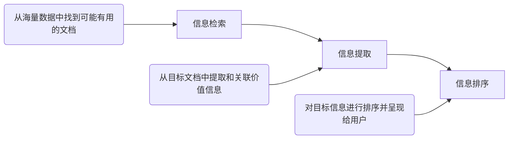

## 课程背景

- [x] 案例1：文档搜索
  - 基于搜索关键词，寻找最相关的文档，是信息检索的基本任务
- [x] 案例2：多模态搜索
  - 从单一的文本信息到更为复杂的多模态搜索，任务与方法都在拓展
- [x] 案例3：面向知识的搜索
  - 人们已不再满足于单纯呈现原始的文档，而需要更加精炼的知识表达与更加直观的需求解决

## 课程框架

- [x] 本课程所要解决的问题
  - Web信息如何获取？【网络爬虫】
  - Web信息如何整理与存储？【文本处理、索引】
  - Web信息如何有效搜索？【查询/排序/评估】
  - 如何提炼价值信息与知识？【信息抽取】
  - 如何基于知识进行推理应用？【知识图谱应用】
  - 大语言模型技术将为信息检索带来什么？【LLM导论】

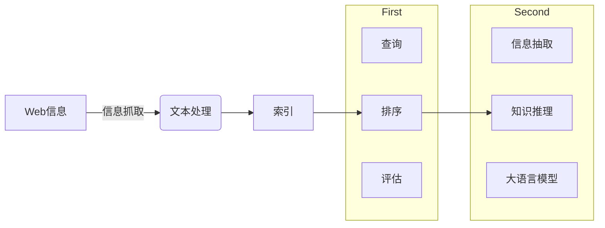

## 课程内容

- [x] 围绕“ $\color{red}{信息检索}$ ”、“ $\color{blue}{知识图谱}$ ”两大模块

<p align="center">
  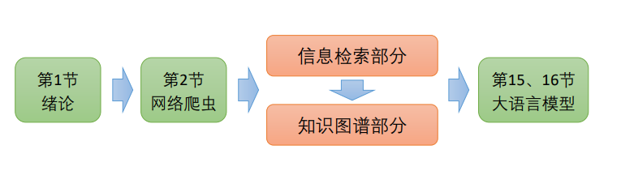
  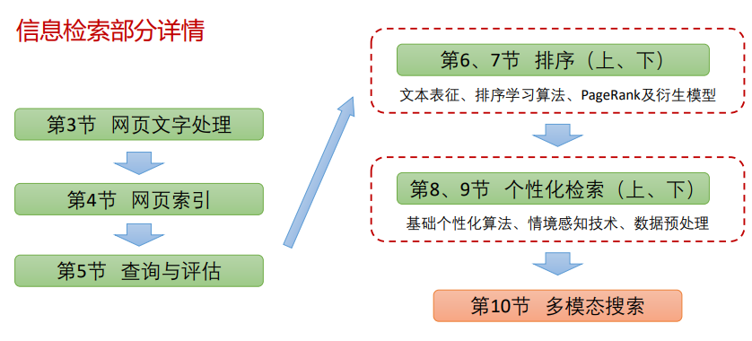
  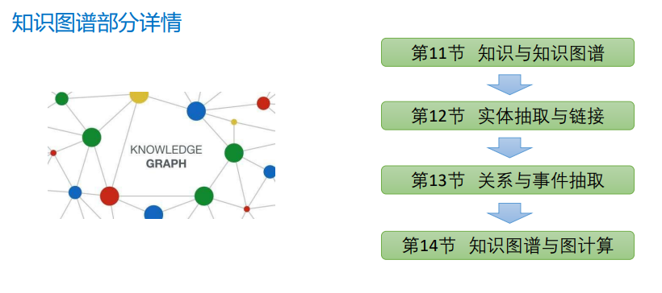
</p>

## Web 信息基础

### Web信息起源

- [x] Web信息起源：1965，超文本概念提出
  - Ted Nelson在1965年提出了超文本的概念。
    > - HyperText，源自于“非连续性著述”( `Non sequential writing` ，Web的第一个特性)的理念，即分叉的、允许读者作出选择的文本。
    > - 以海量数据为基础，使原先的线性文本变成无限延伸、扩展的非线性文本。
  - 超文本传输协议(HTTP ，HyperText Transfer Protocol)
  - 超文本标记语言(HTML，HyperText Markup Language)

- [x] Web信息起源：1969，因特网起源
  - 1969年，互联网的原型 `ARPANet` 由美国国防部研究计划署(DARPA)所制定的协定下诞生，首先用于军事连接。
    > - 起初只有4个结点，分布在UCLA等四所大学的4台大型计算机。
    > - ARPANet的试验较好地解决了异种机网络互联的一系列理论和技术问题，并推动了TCP/IP协议的诞生(1983)。
  - 1986年，美国国家科学基金会(NSF)建立NSFNet广域网，逐渐取代了ARPANet。

- [x] Web信息起源：1989，万维网诞生
  - 1989年，欧洲核子物理研究所(CERN)的Tim Berners Lee(万维网之父)等人首次提出了一个分类互联网信息的协议，即World Wide Web
    > - 在1990年，他写出了第一个网页：http://info.cern.ch
    > - 他定义了URLs、HTML、HTTP等的规范，使网络能够为大众所使用。
    > - 他创立了万维网联盟(World WideWeb Consortium，W3C)并担任主席

### Web特点

- Web的信息流视角：Web 1.0时代


- Web的信息流视角：Web 2.0时代
  - 我们每个人，既是信息的消费者，也是信息的生产者

- Web的信息流视角：Web 3.0时代
  - 两个不同方向但又相互耦合的猜想
    > - $\color{red}{更加个性化、更加智能化、跨越平台与站点的信息大一统}$
    > - $\color{blue}{更加去中心化，基于区块链支撑的用户确权，以用户为中心}$

### Web搜索发展史

#### 搜索起源

- [x] 搜索引擎发展史：1990年，Archie
  - Archie：一般公认最早的搜索引擎
    > - 由麦吉尔大学的Alan Emtage等几位学生发明，用于搜索互联网上的匿名FTP
    > - Archie依靠脚本文件搜索互联网上的匿名FTP(无需登录信息)，然后根据用户需求反馈相应的文件，它的实质是一个可搜索的FTP文件名列表。
  - 目前仍有少量提供Archie服务的网站

- [x] 搜索引擎发展史：1993年，Wanderer
  - Wanderer：最早的爬虫
    > - 由MIT的学生Matthew Gray设计
    > - 原意用于统计互联网上服务器的数量，而非为搜索引擎所设计
  - Wandex：最早的网页索引计划
    > - Wanderer后来发展为可以捕获网址，而为这些网址建立索引的计划就是Wandex
  - 其他诞生于1993年的Robots
    > - ALIWEB(Archie-like Index of WEB，发表于首届WWW会议)
    > - WWW Worm，收集了海量多媒体文件，并可通过关键词检索

- [x] 搜索引擎发展史：1994年，Yahoo！
  - 1994年，最老的“分类目录”搜索数据库之一Yahoo诞生
    > - 由美籍华人Jerry Yang(杨致远)与David Filo所共同创造
    > - 最早的Yahoo的数据是手工输入的，实际上只是一个可搜索的目录
    > - 1995年，Yahoo网站正式上线

- [x] 搜索引擎发展史：1994年，Lycos
  - 1994年诞生，搜索引擎中的元老，是最早提供信息搜索服务的网站之一
  - 通过前缀匹配与字符近似匹配，提供网页自动摘要和相关性排序，数据量较大，整合了搜索数据库、在线服务和其他互联网工具
  - 2000年被西班牙网络集团收购后，目前是全世界最大的西班牙语搜索引擎

- [x] 搜索引擎发展史：1994年，Infoseek
  - 1994年诞生，沿袭了Yahoo！与Lycos的概念。
  - 1995年，与网景公司(Netscape)的战略性协议实现强强联合
  - 2001年2月，Infoseek改用Overture的搜索结果
  - 李彦宏曾担任Infoseek核心工程师，主导了Infoseek的革新换代

- [x] 搜索引擎发展史：1995年，Metacrawler
  - 1995年，第一个元搜索引擎诞生，由华盛顿大学的两位硕士生共同开发
  - 元搜索引擎的概念(Meta SearchEngine Roundup)
    > - 用户提交搜索后，由元搜索引擎负责转换处理，然后提交给多个预先选定的独立搜索引擎
    > - 各独立搜索引擎返回查询结果后，再集中处理并返回给用户

- [x] 搜索引擎发展史：1995年，Altavista
  - 第一个支持自然语言搜索的引擎
  - 第一个实现高级搜索语法的引擎
    > - AND、OR、NOT等
  - 2003年，Altavista被Overture收购，后者是Yahoo的子公司

- [x] 搜索引擎发展史：1997年，Google
  - 1997年，全球最大的搜索引擎Google诞生。
  - 1995年，Larry Page(PageRank因此得名)来到斯坦福攻读博士，并开始研究网络链接项目
  - 他与Sergey Brin提出了PageRank技术，并用于搜索引擎，从而改写了搜索引擎的定义
  - 1997年，Google.com域名被注册，1998年，Google公司正式成立

- [x] 搜索引擎发展史：1997年，天网
  - 国内第一个基于网页索引搜索的搜索引擎，见证了中国互联网发展史
    > - 由北京大学网络实验室研究开发，是国家重点科技攻关项目"中文编码和分布式中英文信息发现"的研究成果。
    > - 于1997年10月29日正式在CERNET上向广大互联网用户提供Web信息搜索及导航服务
    > - 教育网优势，FTP搜索功能强大

- [x] 搜索引擎发展史：2000年，百度
  - 2000年，由前Infoseek资深工程师李彦宏创立
    > - 专注于中文搜索领域，目前是最大的中文搜索引擎
    > - 2003年，根据某在线调查，百度已超越Google成为中国网民首选的中文搜索引擎

- [x] 搜索引擎发展史：下一代搜索引擎？
  - 2009年，Wolfram Alpha上线
    - 搜索引擎？计算知识引擎！
    - 直接向用户返回答案，而不是返回网页链接
      > - 倘若输入“抛10次，4次正面向上”，它可以回答抛硬币的概率问题。甚至连某地下一次日食的时间，或者国际空间站现在的位置，它都能给你答案
  - 2016年，微软小冰读心术
    - 如何明确用户的检索需求？
    - 通过若干连续问题确认用户的真实意图，避免歧义干扰
      > - 本质是决策树的应用
      > - 背后有庞大的数据库支撑
      > - 如何设计提问策略是核心问题
  - 2023年，NewBing
    - 与大模型相结合，开启信息检索新时代
    - 从提供信息，抽取/归纳信息到“生成”信息，提供更灵活与更友好的服务
      > - 基于海量数据堆积而成的“涌现”能力
      > - 借助思维链“去伪存真”
      > - 用户反馈与互动帮助其成长
      > - `小心背后的“幻觉”现象`

### Web搜索的挑战

- [x] 来自三方面的挑战：数据、用户、利益


<!-- tabs:start -->

#### **来自数据的挑战**

<!-- tabs:start -->

##### **海量数据**

- 数据的积累，无论绝对增长还是相对增速都是惊人的数字

##### **异构数据**

- 无论是网页结构的不同，还是数据模态的不同，都对Web信息的有效处理带来了挑战

##### **数据质量**

- Web中包含大量未经编辑处理或权威确认的信息，可能导致错误、无效或误导

##### **数据不稳定性**

- 许多网站和文档快速的添加和消亡，导致大量死链的存在
- 甚至，已有网页内容也在不断地发生更新

<!-- tabs:end -->

#### **来自用户的挑战**

<!-- tabs:start -->

##### **查询需求的表达**

- 用户可能无法采用规范、清晰的方式表达其查询需求
- 用户表达的非规范性 × 语义演化的日新月异 → 玩梗

##### **知识需求与直观表达**

- 技术使人们缺乏耐心，希望直接从搜索引擎获得答案，而不是通过阅读文档自行得到答案

##### **个性化需求**

- 大众化的信息需求被个性化、差异化的信息需求所取代

<!-- tabs:end -->

#### **来自利益的挑战**

<!-- tabs:start -->

##### **SEO对于搜索的干扰**

- 搜索引擎优化( `Search Engine Optimization` )，可能提升网站效率，也可能因滥用搜索算法而影响正常使用

##### **竞价排名对于搜索的干扰**

- 基于广告改变排序，对使用者产生误导

##### **低质内容的滥觞——洗稿**

- 技术的滥用导致洗稿工具等手段盛行拉低内容质量，恶化用户体验

<!-- tabs:end -->

<!-- tabs:end -->

## 信息检索概述

### 基本概念

- [x] 信息检索(Information Retrieval)
  - 基本含义：给定用户需求，从数据库中寻找并反馈相关的文档
    - Query：用户的查询需求
    - Corpus：待检索的数据库
    - Relevance：文档满足查询需求的程度
  - <kbd>信息检索是关于信息的结构、分析、组织、存储、搜索(Search)和获取(Retrieval)的领域 <br>—— Gerard Salton，1968</kbd>

### 信息检索的发展历史

- 1950年，明尼苏达大学的Calvin Mooers提出了“信息检索”这一概念
- 1960年代，康奈尔大学的Gerard Salton研发了SMART系统，被视作信息检索的鼻祖
- 1970年代，SIGIR成立，信息检索领域的旗舰学术会议由此开始
- 1980年代，商用IR系统开始出现
- 1990年代，TREC会议于1992年起始，开始标准测评、Web搜索等研究

### 信息检索 vs. 数据库

- [x] 数据库属于标准的结构化数据，而信息检索往往面临文本、图像、视频等非结构化或半结构化数据。
- [x] 数据库依赖精确的查询条件，而信息检索的查询词更加自由，匹配也相对粗疏
- [x] 数据库对排序并不强调，而信息检索的效果关键在于相关性排序

### 信息检索的应用场景

- 通用搜索
  - 一般的Web搜索，IR最常见的应用

- 垂直搜索(Vertical Search)
  - 搜索被限定在特定的主题和领域上

- 内部搜索
  - 内部网络甚至个人电脑中的搜索引擎

- P2P搜索(Peer-to-peer Search)
  - 由节点构成的网络中寻找信息，但没有集中式的控制

### 信息检索的基础问题

<!-- tabs:start -->

#### **查询理解**

- [x] 信息需求是人们发送查询的背后动因
- [x] 准确理解查询需求是信息检索的前提
- [x] 用户是搜索质量的终极判定者，需要通过与用户的交互，帮助用户表达他们的信息需求
  - 通过上下文信息去除歧义影响
- [x] 查询建议、查询扩展等应用

#### **相关性计算**

- [x] 相关性是判断是否满足需求的基础，基于相关性的排序决定了文档呈现顺序
- [x] 单纯依赖查询和文档的简单匹配，未必能够得到所需的结果
- [x] 不同类型的检索模型(Retrieval Model)导致了不同假设的相关性计算

#### **效果评估**

- [x] 信息检索的质量取决于反馈文档与用户期望的匹配程度
- [x] 常见的评价指标：准确率(Precision)、召回率(Recall)、F值(F-measure)等
- [x] 活跃的基准测试项目：TREC
  - https://trec.nist.gov/
  - 围绕问答、特定领域检索、主体识别等项目展开测评

#### **检索性能**

- [x] 如何快速响应用户的检索需求？
- [x] 如何利用索引减少检索所需时间？
- [x] 如何对检索条件和规则进行模块化，以实现效果与效率的均衡？

<!-- tabs:end -->

# 第二章 爬虫基础

> - Python教程(第21节-第29节部分)
> - https://www.bilibili.com/video/BV1ws411i7Dr/
> - Python爬虫全套课程
> - https://www.bilibili.com/video/BV1Yh411o7Sz

- [x] 如果觉得听课太累，下面还有更简洁的实战教程
  - 零基础入门版
    - https://zhuanlan.zhihu.com/p/21479334
  - 常用工具
    - https://zhuanlan.zhihu.com/p/110448373
    - https://zhuanlan.zhihu.com/p/57678048
- [x] 实战教程
  - 卷王版
  - 一个收集各种爬虫(默认爬虫语言为 python)的集合(如Bilibili用户、京东商品等)，一应俱全。不过有的失效或者不更新了，大佬们自由发挥。
  - https://github.com/facert/awesome-spider
- [x] 进阶版：分布式爬虫
  - 含豆瓣热门、百度贴吧、百度翻译3个实例。建议循序渐进。
    - https://github.com/Kr1s77/Python-crawler-tutorial-starts-from-zero
- [x] 拓展(移动端数据如何获取？)
  - 微信小程序 Charles抓包
    - https://blog.csdn.net/HeyShHeyou/article/details/90452656
  - 手机APP fiddler抓包
    - https://zhuanlan.zhihu.com/p/34430703

## 网络爬虫的定义与需求

- [x] Web网络的图模型
  - 以网页为节点、超链接(Hyper-Link)为有向边

<p align="center">
  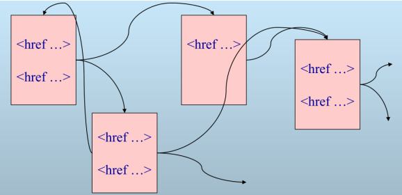
</p>

- [x] 爬虫的任务定义
  - 从一个种子站点集合(Seed sites)开始，从Web中寻找并且下载网页，获取排序需要的相关信息，并且剔除低质量的网页。
  - 常见的爬虫类型
    - 通用网络爬虫：目标为全网Web信息，主要为门户站点搜索引擎和大型Web服务提供商采集数据。
    - 聚焦网络爬虫：选择性爬取与预定主题相关的内容。
    - 增量式网络爬虫：对已下载内容进行增量式更新并只爬取更新内容。
    - 深度网络爬虫：专门负责获取搜索引擎无法索引的、超链接不可达的或提交表单后才可见的网络内容。

- [x] 爬虫的基本用途
  - 数据展示、引擎优化、数据分析、特定应用

- [x] 爬虫的基本流程

<p align="center">
  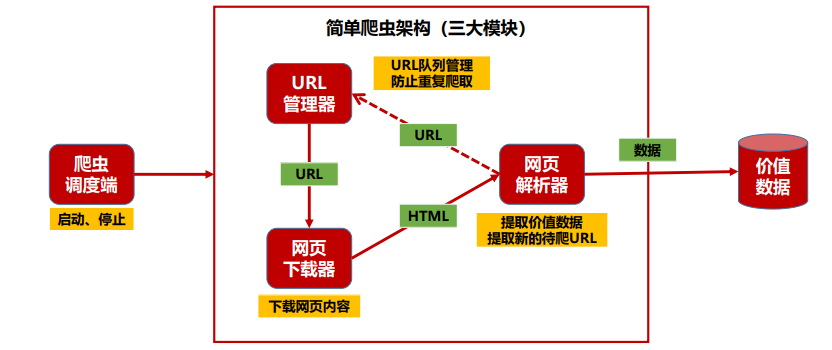
</p>

> - 从爬取网页中获取更多URL，充实URL库，进而获取新的网页

### 爬虫的数量覆盖率问题

<!-- tabs:start -->

#### **问题——“全”**

- [x] 遍历完备性无法保证
  - 孤立节点的存在(如下图右半部分)
  - 其他影响遍历的因素
  - 部分“偏远”节点难以遍历
  - 网络结构的动态演化
  - IP/Robots等条件的约束

<p align="center">
  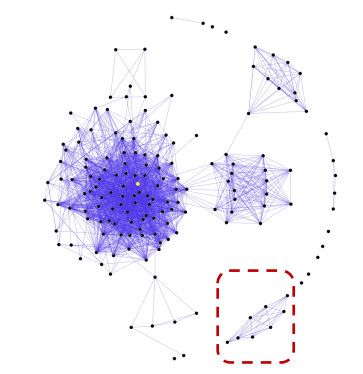
</p>

#### **问题——“好”**

- [x] 如何度量网页的重要性？
  - 启发式方法：出入度…
  - 基于结构：PageRank/HITS…
  - 开放问题：信息密度衡量？
- [x] 不仅重要，还要保证时效
  - “时新性”的要求

<p align="center">
  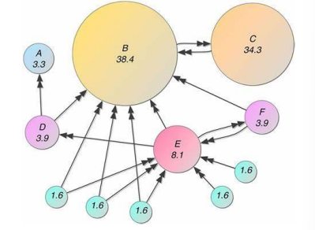
</p>

<!-- tabs:end -->

### 爬虫的主要需求

- <span style="color:blue;">速度(Speed)</span>：突破网络瓶颈，最短时间内获取所需网页
- <span style="color:blue;">可扩展性(Scalability)</span>：基于多爬虫机制，有效打破单爬虫效率天花板
- <span style="color:blue;">健壮性(Robustness)</span>：有效应对服务器陷阱等潜在问题
- <span style="color:blue;">时新性(Freshness)</span>：保持内容的时效性，提升用户体验
- <span style="color:blue;">友好性(Politeness)</span>：遵循网络秩序，不影响网络服务正常运转
- <span style="color:blue;">合法性(Legitimacy)</span>：遵守相关法律，不侵犯用户隐私、商业机密等

<!-- tabs:start -->

#### **速度**

- [x] 2012年的统计数据：谷歌每天需要爬取200亿个页面
  - 以每周1400亿个页面计算，约为 $2^{37}$ 个页面
  - 平均每个页面64KB，约为 $2^{16}$ 个bit
    - 实际情况远远不止64KB，大量非文本内容
  - 可知每秒流量>100Gb/s
- [x] 网络瓶颈的存在对速度的限制
  - 以家用100Mbps网络为例，考虑以太网MTU为1500字节(<span style="color:green;">上限了！</span>)，即使达到100%利用率，每秒也仅传输约8333个网页

#### **可扩展性**

- [x] 单一爬虫工作效率低下，难以突破效率天花板。
- [x] 采用多爬虫机制已成为大型搜索引擎的工作常态。
- [x] 多个爬虫带来新的挑战
  - 如何管理多个并发的连接？
  - 不同爬虫负责不同URL，如何进行划分？
  - 过多的硬件并行好处并不大
    - 抓取的性能瓶颈出现在通讯和硬盘读写

#### **健壮性**

- [x] 如何有效应对爬取过程中所面临的各种风险？
  - 爬取网页时陷入回路怎么处理？
  - URL不规范如何解决？
  - 服务器陷阱如何应对？
  - 系统崩溃如何处理？

#### **时新性**

- [x] T时刻的时新性：所抓取的网页内容与T时刻该网页的最新内容一致
- [x] 网页年龄：距离网页最近一次更新的时间
  - 通过对网页更新行为的建模来预测年龄
- [x] 保持爬取内容的时新性能够提升搜索效果
  - 但同时，过度重视时新性将严重增加搜索引擎的负担。
  - 部分网页频繁更新，增加抓取难度

#### **友好性**

- [x] 不能显著影响被爬取的服务器性能
  - 大量DNS查询可能造成类似DDOS的效果
- [x] 有些服务器可能不希望被爬取
  - Robots exclusion
  - 反面教材：360搜索、头条搜索

#### **合法性**

- [x] 法律中的规定
- [x] 我国：《互联网搜索引擎服务自律公约》，无针对爬虫的特定规定，但爬取的数据可能侵犯用户隐私权、违反《反不正当竞争法》等
  - 欧盟：GDPR
  - 加州：CCPA
  - …… 

<!-- tabs:start -->

##### **Linkedin vs hiQ(2019)**

- [x] hiQ作为数据分析公司爬取Linkedin的数据，Linkedin发出要求终止的信函之后限制了hiQ访问数据。最终最高法院判决Linkedin 不得作出限制。

##### **杭州魔蝎科技侵犯公民个人信息案(2021)**

- [x] 魔蝎科技将开发的前端插件嵌入网贷平台App中，利用各类爬虫技术，爬取用户本人账户内的通话记录、社保、公积金等各类数据，并提供给网贷平台用于判断用户的资信情况

<!-- tabs:end -->

#### **友好 & 合法**

- [x] 一个合适的爬虫是怎样的
  - 只爬取需要的数据
  - 满足被爬站点的使用协议
    - 注意：Robots协议被认定为搜索引擎行业内公认的、应当被遵守的商业道德
  - 不对被爬网站造成不良影响(如造成DDoS)
  - 不收集可定位到个人的信息(数据脱敏/合并)
  - 保护好被爬取的数据

<!-- tabs:end -->

- [x] 友情提示：爬虫本中立，数据应保护
  - 遵守协议，不要爬取隐私、涉密数据
  - 爬取方式应友好且合法，不影响网站正常运行
  - 如果不幸吃上大碗牢饭，不把为师说出去就行了

## 爬虫的基本要素

### 爬虫所涉及的协议和要素

- [x] HTML / HTTP
- [x] DNS / URL
- [x] Sitemap
- [x] Robots Exclusion

<!-- tabs:start -->

#### **HTML / HTTP**

<!-- tabs:start -->

##### **HTML**

- [x] 如何表示与获取网页中的链接结构？

<p align="center">
  
</p>

- [x] HTML文件示例

<p align="center">
  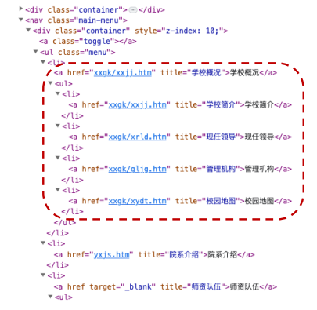
</p>

- [x] HTML的基本概念
  - HyperText Markup Language，书写网页的“框架语言”
  - 基本组成：“标记”(Tags)+“文本内容”(Text)
    - 例如： `<a href="http://www.ustc.edu.cn/2062/list.htm">学校概况</a>`
  - 标记的作用：
    - 说明网页元数据(如“标题”等)
    - 说明文本内容的布局和字体、字号等信息
    - 嵌入图片、视频、创建超链接等

- [x] HTML的示例框架

```html
<!DOCTYPE HTML PUBLIC "-//W3C//DTD HTML 3.2 Final//EN">
<html>
<head>
  <title> This is the title but often omitted </title>
</head>
<body>
  
  other text
  <a href = “url2” title=“anchor text”> this is link text </a>
</body>
</html>
```

- [x] HTML中具有特别意义的文字

```html
<head><title> text </text></head>
```
> 是搜索服务显示的内容之一（URL，标题，摘要等）

```html

```

> 图片描述，可以帮助我们做“从文字到图片”的查询

```html
<a href=“url” title=“text”>link text</a>
```

> 有助于理解目标网页内容及网页之间在内容上的关系

##### **HTTP**

- [x] HTTP的基本概念
  - 超文本传输协议(HyperText Transport Protocol)
    - 工作在TCP 之上(请求/应答方式)
    - 容许在一个TCP 连接上发多个HTTP请求
  - 工作步骤(从客户端看)
    - 通过域名服务器(DNS)得到服务器主机的IP地址
    - 用TCP和服务器建立联系
      - 发送HTTP请求(例如，GET或POST)
      - 接收HTTP应答头
      - 接收HTML网页内容

- [x] HTTP的应用实例

<p align="center">
  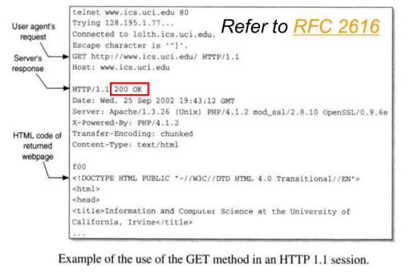
</p>

- [x] HTTP的状态代码分类

<p align="center">
  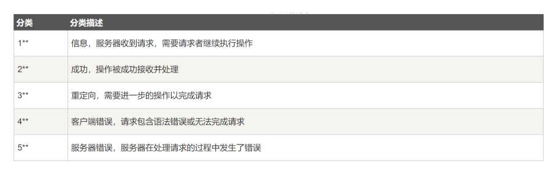
</p>

> - 重点记住一些特殊的状态码，如：200(OK)，403(Forbidden)，404(Not Found)……

<!-- tabs:end -->

#### **DNS / URL**

<!-- tabs:start -->

##### **DNS**

- [x] DNS的基本概念和作用
  - 域名系统(Domain Name System)
    - 将域名和IP地址相互映射的一个分布式数据库。
    - DNS地址解析可能成为重要瓶颈，甚至造成类似DOS的攻击效果

<p align="center">
  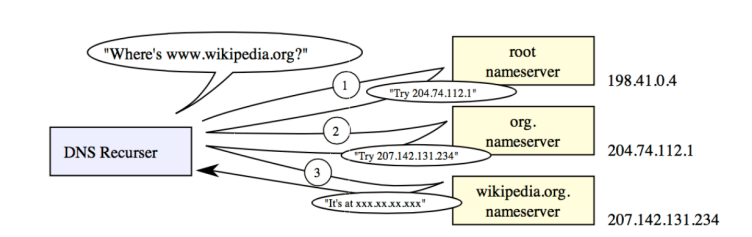
</p>

- [x] 如何提高DNS解析模块的性能？
  - `并行DNS Client`
  - `缓存cache DNS results`
  - `预取prefetch client`

<!-- tabs:start -->

###### **并行 DNS Client**

- [x] 并行的地址解析Client
  - 专门对付多个请求的并行处理
  - 容许一次发出多个解析请求
  - 协助在多个DNS server之间做负载分配
    > - 例如，根据掌握的URL进行适当调度

###### **缓存 cache DNS results**

- [x] 增加DNS缓存的重要性
  - 面向海量URL和主机的搜索任务，如果没有DNS缓存，会造成频繁查询DNS服务器，从而造成类似于拒绝服务攻击(DOS)的副作用。
  - 针对小规模的网页搜索(如百万量级)，可利用建立在内存中的DNS映射，既能加快网页信息的获取，后能降低对于DNS服务器的压力。
- [x] DNS缓存的内容
  - Internet的DNS系统会定期刷新，交换更新的域名和IP信息
  - 缓存中有部分信息过期影响不大，但注意要适度刷新

###### **预取 prefetch client**

- [x] 为了减少等待查找涉及新主机的地址的时间，尽早将主机名投给DNS系统
- [x] 与缓存系统的区别：缓存 – 用了才缓存；预取 – 不用也暂时先缓存
- [x] DNS预取的基本步骤
  - 分析刚刚得到的网页
  - 从<href>属性中提取主机名
  - 向缓存服务器提交DNS解析请求
  - 结果存放在DNS缓存中(也可能用上，也可能用不上)

<!-- tabs:end -->

##### **URL**

- [x] URL的基本概念
  - 统一资源定位符(Universal Resource Locator)
    - 以某种统一的(标准化的)方式标识资源的简单字符串。
  - URL一般由四部分组成：
    - 访问资源的模式/协议。
    - 存放资源的主机名。
    - 资源自身的名称，由路径表示。
    - 被访问的文件名或主页名。

- [x] URL与IP地址的对应关系
  - 一般而言，域名与IP地址处于一一对应的关系
  - 实际情况下，域名与IP地址之间存在复杂的对应关系
    - 一对一：基本的对应关系
    - 一对多：可能由于虚拟主机导致，使得多个URL映射到同一IP
      - 例如，www.pku.edu.cn / www.gh.pku.edu.cn 等都映射到162.105.129.12上，但由于各个站点内容不同，所以被认为是不同的Web服务器
    - 多对一：可能由于DNS轮询导致，以应对商业站点的负载问题
      - 例如，多个182.61.200.x均与www.baidu.com 映射。
      - 奇怪的案例：输入www.玩原神玩的.com会跳转到我校主页(谁干的!?)

- [x] URL链接提取与规范化
  - 目标：得到网页中所含URL的标准型
    - URL的处理与过滤，避免多次获得不同URL指向的相同网页
    - 相对URL：基础URL被省略，需要进行补齐
  - URL的不规范现象
    - 不同URL可能指向同一个网页
    - URL的格式存在错误或无用内容
      - 多余的文件名(如index.html)，无用的查询变量或空的查询条件
    - 动态网页与动态参数
    - <span style="color:blue;">短链接</span>

- [x] 一些URL规范化的操作
  - URL的基本组成：协议:// 主机名[: 端口]/ 路径/[: 参数] [? 查询]#Fragment
    - protocol ://hostname[:port]/path/ [;parameters][?query]#fragment
  - 一些常见的URL规范化示例
    - URL协议名和主机名的小写化
      > - HTTP://WWW.BAIDU.COM -> http://www.baidu.com
    - 删除Fragment（#）或多余的查询串，如?，&
      > - http://www.example.com#seo -> http://www.example.com
    - 删除默认后缀或多余的www
      > - http://www.example.com/index.html -> http://example.com

<!-- tabs:end -->

#### **Sitemap，站点地图**

- [x] 放在服务器根目录中的sitemap.xml，为爬虫指明抓取的建议
  - 协助爬虫找到隐藏的网页(如需要查询或表单才能够访问的内容)
  - Changefreq属性还提供有关更新频率的说明，以协助保障时新性

<p align="center">
  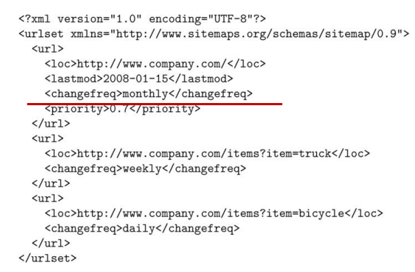
</p>

- [x]  案例：中央政府门户网站的站点地图-百度版本(http://www.gov.cn/baidu.xml)

<p align="center">
  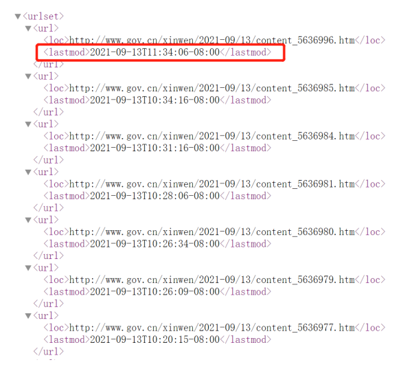
</p>

#### **Robots Exclusion，排斥协议**

- [x] Sitemap是允许协议，而Robots是排斥协议
- [x] 在服务器文档根目录中的文件robots.txt，包含一个路径前缀表，描述了服务器给出的抓取限制
- [x] 例如，腾讯新闻的Robots.txt(news.qq.com/robots.txt)

<p align="center">
  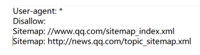
</p>

- [x] 案例：中央政府门户网站的Robots.txt(www.gov.cn/robots.txt)

<p align="center">
  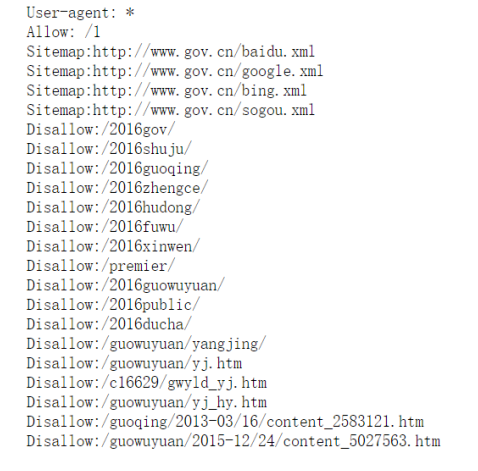
</p>

- [x] 该限制只针对爬虫，一般浏览不受影响
- [x] 该限制属于“君子协定”，没有强制执行力
  - 但目前，绝大多数搜索引擎都遵守该限制

<p align="center">
  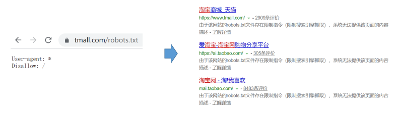
</p>

<!-- tabs:end -->

## 面向API的新爬虫任务

### API的基本概念

- [x] 应用程序接口(Application Programming Interface)
- [x] 2000年，Salesforce和eBay推出了自己的API，程序员可以访问并下载一些公开数据。从那时起，许多网站都提供API用于访问公共数据库。
- [x] 通过开放的API 来吸引更多的用户和更多的创意，与具备分享、标准、去中心化、开放、模块化的Web 2.0时代相得益彰，为创造者和平台都带来价值。
- [x] 同时，网页API也为开发人员提供了一种更友好的网络爬虫方式：
  - 直接获取资源列表，清晰、明确
  - 接收JSON或XML等格式化数据的反馈

### 基于API的数据爬取示例

- [x] 基于豆瓣提供的API，获得评分最高的20部电影信息

<p align="center">
  
</p>

### 基于API的数据爬取一般流程

<p align="center">
  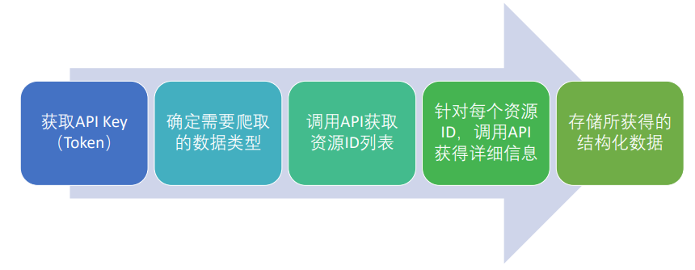
</p>

> 其中，第3-4步可能存在循环，即通过获得某个资源ID对应的详细信息，获得更多其他资源ID，并继续抓取更多信息。

### Token的概念、作用与取得方式

- [x] API的调用需要用户身份认证(用户授权)，而Token相当于授权后的通行证
- [x] 使用Token认证而非用户名/密码认证方式的优点
  - `Token` 的生成完全独立于帐号密码，往来通信不会影响账号安全
  - 即使 `Token` 丢失或泄露，只需登录后台删除该Token即可

<p align="center">
  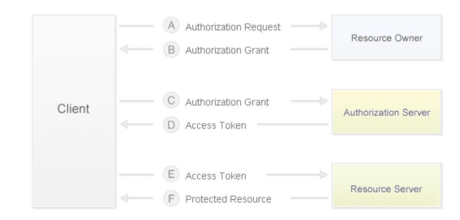
</p>

> 目前微博的API认证授权机制

### 结构化数据反馈

<!-- tabs:start -->

#### **XML**

- [x] 可扩展标记语言(Extensible Markup Language)
  - 是一种允许用户对自己的标记语言进行定义的源语言。
  - 提供统一的方法来描述和交换独立于应用程序的结构化数据。
- [x] XML相比于HTML的优势所在：
  - 可扩展性方面：HTML不允许用户自行定义标识或属性，而在XML中，用户能够根据需要自行定义新的标识及属性名。
  - 结构性方面：HTML不支持深层的结构描述，XML的文件结构嵌套可以复杂到任意程度，能表示面向对象的等级层次。
  - 可校验性方面：HTML没有提供规范文件以支持结构校验，而XML文件可以包括一个语法描述，使应用程序可以对此进行结构校验。

<p align="center">
  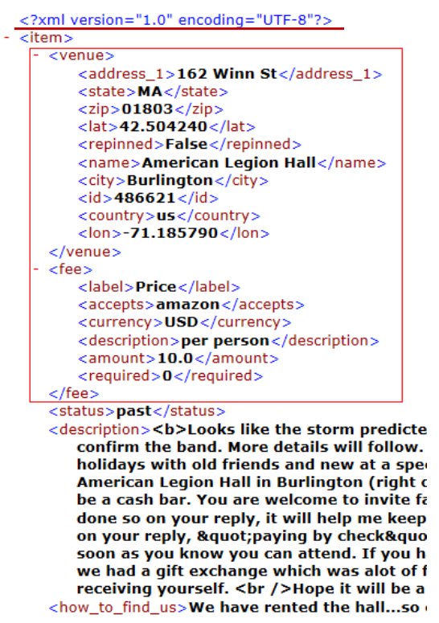
</p>

- [x] 必须有XML声明语句作为文档开头
- [x] 良好的XML文档有且只有一个根节点
  - 例如，在本实例中为 `item`
- [x] 可根据需要嵌套文件结构
  - 例如， `<venue>` 中包含 `<city>` 信息
- [x] 所有的标记必须有相应的结束标记
  - 例如， `<zip>` 与 `</zip>` 的成对出现
  - 注意，所有的空标记也必须被关闭

#### **JSON**

- [x] JS 对象表示法(JavaScript Object Notation)
  - 轻量级的数据交换格式，采用完全独立于编程语言的文本格式。
  - 简洁和清晰的层次结构使得 JSON 成为理想的数据存储和交换语言。
  - 易于人阅读和编写，同时也易于机器解析，并有效地提升网络传输效率。

```json
"name":"Michael",
"address":
{
  "city": "Beijing",
  "street": "Chaoyang Road",
  "postcode": 100025
}
```

- [x] JSON中的六大构造字符
  - “[”“]”表示数组开始/结束
  - “{”“}”表示对象开始/结束
  - “:”表示名称的分隔符，“,”表示值的分隔符
  - 从内容表示上看，JSON更为轻量，但在无缩进情况下层次化解析相对困难

#### **JSON与XML的区别**

- [x] XML的优点：格式统一、标准，容易与其他系统进行远程交互，方便共享
- [x] XML的缺点：文件庞大，文件格式复杂，解析复杂且方式繁多，工作量大
- [x] JSON的优点
  - 数据格式比较简单，易于读写，格式经过压缩，占用带宽小；
  - 支持多种语言，易于解析，可以简单的进行数据的读取；
  - 能直接为服务器端代码使用，大大简化了开发和维护工作。

- [x] XML与JSON格式对比

```xml
<?xml version="1.0" encoding="utf-8"?>
<root>
  <resultcode>200</resultcode>
  <reason>Return Successed!</reason>
  <result>
    <area>江苏省苏州市</area>
    <location>电信</location>
  </result>
</root>
```

```json
{
  "resultcode": "200",
  "reason": "Return Successed!",
  "result":{
    "area": "江苏省苏州市",
    "location": "电信"
  }
}
```

<!-- tabs:end -->

## 常见的爬虫算法

### 最最基础的算法

<!-- tabs:start -->

### **最最基础的算法**

```algorithm
\begin{algorithm}
\caption{SPIDER}
\begin{algorithmic}
\PROCEDURE{SPIDER}{$G$}
  \STATE Let root $:=$ any URL from $G$
  \STATE Initialize Stack <stack data structure>
  \STATE Let Stack $:=$ Push(root, Stack)
  \STATE Initialize Collection <big file of URL-page pairs>
  \WHILE{Stack is not empty}
    \STATE current\_URL $:=$ Pop(Stack)
    \STATE page $:=$ look-up(current\_URL)
    \STATE Store(<current\_URL, page>, Collection)
    \FOR{every URL\_i in page}
      \STATE Push(URL\_i, Stack)
    \ENDFOR
  \ENDWHILE
  \STATE Return Collection
\ENDPROCEDURE
\end{algorithmic}
\end{algorithm}
```

- [x] 潜在风险：
  - 重复收集的问题？
  - 回路或不连通的解决方法？
  - 如何控制搜集特定的一部分？

### **最最基础的改进算法**

```algorithm
\begin{algorithm}
\caption{SPIDER}
\begin{algorithmic}
\PROCEDURE{SPIDER}{$G$, \{SEEDS\}}
  \STATE Initialize Collection <big file of URL-page pairs>
  \STATE Initialize Visited <big hash-table>
  \FOR{every root in \{SEEDS\}}
    \STATE Initialize Stack <stack data structure>
    \STATE Stack $:=$ Push(root, Stack)
    \WHILE{Stack is not empty}
      \REPEAT
        \STATE current\_URL := Pop(Stack)
      \UNTIL{current\_URL is not in Visited}
      \STATE Insert\_hash(current\_URL, Visited)
      \STATE page := look-up(current\_URL)
      \STATE Store(<current\_URL, page>, Collection)
      \FOR{every URL\_i in page}
        \STATE Push(URL\_i, Stack)
      \ENDFOR
    \ENDWHILE
  \ENDFOR
  \STATE Return Collection
\ENDPROCEDURE
\end{algorithmic}
\end{algorithm}
```

- [x] 解决方案：
  - 利用BigTable排除重复部分
  - 基于种子集合控制爬取内容
  - 通过更换种子重启动解决回路等

<!-- tabs:end -->

### 重复性的监测问题

- [x] 不仅URL本身可能重复，即使不同URL，也可能导致相似的文档内容
- [x] 完全重复文档的检测方法
  - 检验和(Checksumming)，所有字节进行加和，相同文档有相同检验和
  - 缺陷：相同检验和不代表相同(如打乱顺序)
- [x] 近似重复文档的检测方法：指纹表示法
  1. 对文档进行分词处理，并进行n-gram组合
  2. 挑选部分n-gram用于表示这一文档
  3. 对被选中的n-gram进行散列，以提升检索效率和减少指纹大小
  4. 存储散列值作为文档指纹，通常存储在倒排索引中

#### 遍历策略

<!-- tabs:start -->

##### **广度优先算法**

<p align="center">
  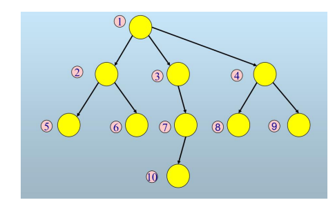
</p>

> 本质是维持一个URL队列，先进先出

```algorithm
\begin{algorithm}
\caption{SPIDER}
\begin{algorithmic}
\PROCEDURE{SPIDER}{$G$, \{SEEDS\}}
  \STATE Initialize Collection <big file of URL-page pairs>/ // 存储URL-页面对的集合
  \STATE Initialize Visited <big hash-table> // 存储已访问的URL
  \FOR{every root in \{SEEDS\}}
    \STATE Initialize Queue <queue data structure>// 待爬取的URL队列
    \STATE Let Queue $:=$ EnQueue(root, Queue)
    \WHILE{Queue is not empty}
      \REPEAT
        \STATE current\_URL $:=$ DeQueue(Queue)
      \UNTIL{current\_URL is not in Visited}
      \STATE Insert\_hash(current\_URL, Visited)
      \STATE page $:=$ look-up(current\_URL)  // 爬取页面
      \STATE Store(<current\_URL, page>, Collection)
      \FOR{every URL\_i in page} 
        \STATE EnQueue(URL\_i, Queue) // 链接提取
      \ENDFOR
    \ENDWHILE
  \ENDFOR
  \STATE Return Collection
\ENDPROCEDURE
\end{algorithmic}
\end{algorithm}
```

##### **深度优先算法**

<p align="center">
  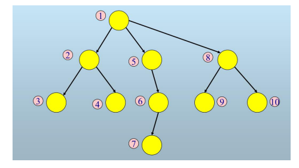
</p>

> 本质是维持一个URL栈，先进后出

```algorithm
\begin{algorithm}
\caption{SPIDER}
\begin{algorithmic}
\PROCEDURE{SPIDER}{$G$, \{SEEDS\}}
  \STATE Initialize Collection <big file of URL-page pairs>// 结果存储
  \STATE Initialize Visited <big hash-table> // 已访问URL列表
  \FOR{every root in \{SEEDS\}}
    \STATE Initialize Stack <stack data structure> // 待爬取的URL栈
    \STATE Let STACK $:=$ Push(root, Stack)
    \WHILE{Stack is not empty}
      \REPEAT
        \STATE current\_URL $:=$ Pop(Stack)
      \UNTIL{current\_URL is not in Visited}
      \STATE Insert\_hash(current\_URL, Visited)
      \STATE page $:=$ look-up(current\_URL) // 爬取页面
      \STATE Store(<current\_URL, page>, Collection)
      \FOR{every URL\_i in page} 
        \STATE Push(URL\_i, Stack) // 链接提取
      \ENDFOR
    \ENDWHILE
  \ENDFOR
  \STATE Return Collection
\ENDPROCEDURE
\end{algorithmic}
\end{algorithm}
```

##### **广度 or 深度优先算法**

- [x] 对于一般的网页爬虫而言，在 <span style="color:blue;">时间无限</span> 的情况下，两种算法可以视作等价
- [x] 假如在<strong style="color:red;">有限步</strong> 条件下，两者的优劣如何？
  - 如果希望获得更为多样化的内容，应采用广度优先
  - 如果希望获得更为深层次的信息，应结合路径选择采用深度优先
    - 部分站点需要深层次浏览以判断站点信息质量
- [x] 此外，不同的<strong style="color:blue;">应用场景</strong>，对两种算法的适应度可能不尽相同
  - 以社交网络场景为例，广度优先有着以下特点：
    - 通常而言，选择度数较高的起点，可以快速到达大量节点
    - 但全局性不佳，难以反映网络全貌
    - 另外，此类采样所得节点的度数往往虚高
    - Facebook网络，随机抽样平均度94，广度优先抽样竟达324

##### **从遍历要求到网页本身重要性的要求**

- [x] 需要对网页的重要性进行评估，进而优先搜集重要的网页
- [x] 根据经验，体现网页重要度的常见特征类别：
  - 启发式特征(简单统计指标)
    - 如，入度、父网页入度、镜像度、较小的目录深度(易于浏览)
  - 结构性特征
    - 如，PageRank/HIT值，各类Betweeness值等
    - 主题类特征(反应网页与特定需求的契合程度)

<!-- tabs:end -->

## 常见反爬虫机制与应对策略

- [x] 有爬虫，就有反爬虫
- [x] 使用任何技术手段，阻止别人批量获取自己网站信息
  - 顺便，大家也一起来当一下免费的数据标注员

> - 常见反爬虫策略及其应对策略如下

<!-- tabs:start -->

### **User Agent**

- [x] 最常见的反爬虫策略，利用访问网站时浏览器发布的Request Headers信息中的User-Agent信息，判断用户使用何种方式浏览

<p align="center">
  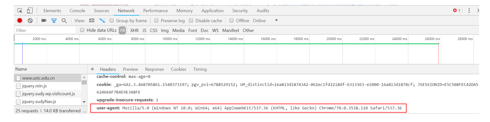
</p>

- [x] 示例代码如下:

```python
# 命名为 UA.py
import requests
html = request.get("https://zhihu.com").content
print(html.decode())
```

> 运行结果如下

```term
$ python UA.py
{"error":{"message":"您当前请求存在异常，暂时限制本次访问","code":40362}}
```

>  - 爬虫往往U-A部分为空

- [x] 应对策略：利用Python的Request库允许用户自定义请求头信息的手段
  - 在请求头信息中将 <kbd style="color:blue;">User-Agent</kbd> 的值改为浏览器的请求头标识，从而绕开反爬虫机制

- [x] 示例如下

```python
# 命名为 UA_new.py
import requests
# 伪造请求头信息 欺骗服务器
headers = {"User-Agent":"Mozilla/5.0 (Macintosh; Inter Mac OS X 10.13; rv:9527.0) Gecko/20100101 Firefox/9527.0"}
resp = requests.get("https://zhihu.com", headers = headers)
print(resp.status_code) # 不打印内容是因为过长
```

> 运行结果如下

```term
$ python UA_new.py
200
// HTTP回应200说明抓取响应成功
```

### **IP/账号访问次数/频率**

- [x] 通过限制特定IP地址/账号访问频率和次数进行反爬
  - 其本质在于判断浏览行为是否是人类行为
- [x] 应对手段：
  - 构造 <strong style="color:blue;">IP代理池</strong> ，然后每次访问时随机选择代理
    - Github中有相关服务，通过各种提供免费IP的网站来提供代理池
  - 每次爬取行为后间隔一段时间
  - 注册多个账号以保障数据收集
    - 挑战：账号本身的成本问题、账号被查封的危险

### **验证码**

- [x] 通过各类验证码，判断浏览者属于人类还是机器
- [x] 应对手段：
  - 简单的字符识别：基于机器学习与模式识别相关技术
  - 复杂的逻辑推理：人工辅助破解

### **动态网页**

- [x] 从网页的url加载网页的源代码之后，会在浏览器里执行JavaScript程序
  - 网页内容由脚本加载，而直接抓取则只能得到空白页面
  - 此类情况在抓取在线播放的音视频文件时尤为常见
- [x] 应对手段：
  - 核心思路：模拟调用请求
  - 使用审查元素分析ajax请求，如此循环直到获得包含数据信息的json文件

### **加密-解密技术**

- [x] 对网页中的关键信息进行加密或混淆，来增加
- [x] 一类常见案例：页面上显示为正常文本，而源代码中为编号
  - 网页加载时需要借助字体库，将编码转为文字
    - 字体库/映射可以动态更新！
    - 解决方法：
      - 通过抓包获取字体库/映射
      - 基于映射进行解码

<p align="center">
  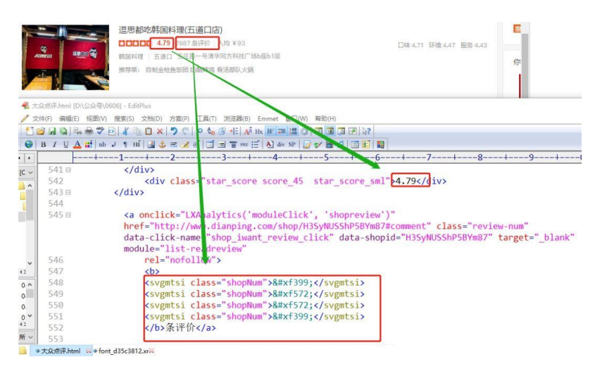
</p>

### **蜜罐技术**

- [x] 网页上会故意留下一些人类看不到或者绝对不会点击的链接。由于爬虫会从源代码中获取内容，所以爬虫可能会访问这样的链接
- [x] 只要网站发现有IP访问这个链接，立刻永久封禁访问者，从而难以继续爬取
- [x] 应对手段：
  - 核心思路：干涉爬虫路径
  - 通过工具库判断页面上的隐含元素，使爬虫避开这些元素，可以部分回避蜜罐的诱导。

### **用户权限限制**

- [x] 不同类型/级别的用户给予不同的内容权限
  - VIP、SVIP、蓝钻、红钻、绿钻、各种钻……
- [x] 应对手段：
  - 氪金，就可以变强

### **其他的反爬虫策略**

- [x] 不同的网页结构：每个相同类型的页面的源代码格式均不相同
- [x] 同样也是双刃剑：增加爬取难度的同时降低用户浏览体验(逼死强迫症)
- [x] 多模态的呈现方式：文字转为图像或视频
- [x] 应对策略：OCR、语音识别、图像/视频标签技术

<!-- tabs:end -->

# 第三章 网页文字处理

- 如何处理网页中的文字信息？
- [x] 问题背景
  - <span style="color:red;">文本处理：概念与目的</span>
  - 信息检索的基本组件，为后续应用（并不限于搜索）提供支撑。
    - 将原始文档转化为词项，以建立索引
    - 使面向查询条件的精准的文档匹配成为可能
  - 文档处理与查询解析是相辅相成的。

## 词条化处理

### 分词的概念与挑战 

#### 分词概念

- [x] <span style="color:red;">词条化(Tokenization)</span>
  - 将给定的字符序列拆分成一系列子序列的过程
    - 其中，每个子序列被称为一个词条（Token）

<p align="center">
  
</p>

- [x] 词条化的主要任务就是确定正确的词条，并避免标点等因素干扰。

#### 分词挑战

<!-- tabs:start -->

##### **英文分词的挑战**

- [x] 词与词组的切分
  - To be or not to be…
- [x] 标点符号的影响
  - 连字符：Self-motivation，引号：大鲨鱼奥尼尔(O’Neal)
- [x] 专有名词的拆分
  - New York University or New / York University？

##### **中文分词的挑战**

- `语素` 是最小的语音语义结合体，是最小的语言单位。
- “字”：简单高效，表示能力较差，不能独立地完整地表达语义信息。
  - 国家标准GB2312-80中定义的常用汉字为 `6763个` 。
- “词”：具有固定的语音形式，可以独立运用的最小的语言单位。
  - 词的表示能力较强，但汉语词的个数在 `10万个` 以上，面临复杂分词问题。
- <span style="color:blue;">最大的挑战：没有显式分隔符(如空格)</span>
  - 英语可视作词的集合，而汉语则是字的集合
  - 无显式分隔符使分辨不同组合方式更加困难
- <span style="color:green;">中文对虚词的运用：不单独表意，但影响句意</span>
  - 古虚词：之乎者也，现代虚词：的、了、吧…
- <span style="color:plum;">分词歧义、未登录词等</span>
- [x] 常见的三类中文分词歧义
  - 交集型歧义(交叉歧义)
    - 如果AB和BC均可单独成词，那么面临“ABC”时即发生歧义
    - 例如，“上海市长江大桥”
  - 组合型歧义
    - 如果AB与A、B均可单独成词，那么面临“AB”时即发生歧义
    - 例如，“温州皮革厂”，也可单独做“温州（的）”、“皮革厂”
  - 真 • 歧义
    - 常见各种文字游戏，如“我也想过过过儿过过的

##### **未登录词的影响(中英皆然)**

- [x] <span style="color:blue;">人名、地名、机构名、商品名等专有名词</span>
  - 例如，肯尼迪(陆) / 甘乃迪(台)
- [x] <span style="color:darkgreen;">专业领域的大量术语</span>

<p align="center">
  
</p>

- [x] <span style="color:blue;">大量涌现的新词语、变异词语</span>
  - 例如，“泰裤辣”、“比博燃”、“绝绝子”、“只因”

##### **其他类型的字符序列**

- [x] 专业术语中文字与符号结合的部分
  - 例如，C++、B-52
- [x] 新类型的字符序列
  - 例如，电子邮箱地址、URL、快递单号等
- [x] 多种语言混杂的表达方式
  - 例如，yyds、awsl、wdnmd

<!-- tabs:end -->

### 常见分词方法 

#### 推荐参考书籍

- [x] 统计自然语言处理
  - 作者: 宗成庆
  - 出版社: 清华大学出版社
  - 出版年: 2008-5
- [x] 其中，第六章介绍了与统计分词方法有关的概率图模型技术，而7.1-7.2节介绍了与自动分词相关的问题背景、
挑战与基本的统计方法。

#### 分词方法

<!-- tabs:start -->

#### **<span style="color:darkblue;">基于字符匹配的方法</span>**

<!-- tabs:start -->

##### **最大匹配分词法**

- [x] 基于匹配的分词方法
  - 又称机械分词方法，它按照一定的策略将待分析的汉字串与一个 <span style="color:blue;">“充分大的”机器词典</span> 中的词条进行匹配，若在词典中找到某个字符串，则匹配成功。
- [x] 基于匹配分词的一般模型
  - 对于机械分词，可以建立一般模型，其形式化表达如下：
    - ASM(d,a,m)，即Automatic Segmentation Model。其中：
      > - d，表示匹配方向，+1为正向，-1为逆向
      > - a：每次匹配失败后增/减字符数，+1为增字，-1为减字
      > - m：最大/最小匹配表示，+1为最大匹配，-1为最小匹配
  - 例如，ASM(+，-，+)即正向减字最大匹配(即FMM方法)
  - ***对于现代汉语而言，最大匹配更为实用(最小匹配过于<span style="color:plum;">琐碎</span>)***

- [x] 常用的机械分词方法

<!-- tabs:start -->

###### **正向最大匹配分词(FMM)**

- [x] Forward Maximum Matching method, FMM。
- [x] 从左至右尽可能查找最长的词，直到当前字符与已经处理的字符串不构成词，输出已经识别的词，并从识别出来的词后面接着继续查找下一个词。
- [x] 分词速度较快，但错误率较高(约 $\frac{1}{169}$ )。

<p align="center">
  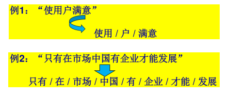
</p>

###### **反向最大匹配分词(RMM)**

- [x] Reverse(也作Backward)Maximum Matching method, RMM。
- [x] 从右至左尽可能查找最长的词，直到当前字符与已经处理的字符串不构成词。
- [x] 统计证实RMM分词效果更好(错误率约 $\frac{1}{245}$ )。

<p align="center">
  
</p>

###### **双向最大匹配分词(BM：FMM+RMM)**

- [x] Bi-directional Matching method, BM。
- [x] 综合比较FMM与RMM两种方法的切分效果，从而选择正确的切分。
- [x] 有助于识别分词中的交叉歧义。

<p align="center">
  
</p>

- [x] 关于双向最大匹配分词，一些有趣的数据
  - 经研究表明，90%的中文使用正向最大匹配分词和逆向最大匹配分词能得到相同的结果，而且保证分词正确
  - 9%的句子是正向最大匹配分词和逆向最大匹配分词切分有分歧的，但是其中一定有一个是正确的
  - <span style="color:darkgreen;">不到1%的句子</span>是正向和逆向同时犯相同的错误：给出相同的结果但都是错的。
- [x] 另一个有趣的统计：在随机挑选的3680个句子中，正向匹配错误而逆向匹配正确的句子占比9.24%，正向匹配正确而逆向匹配错误的情况则没有被统计到

<!-- tabs:end -->

##### **最少切分分词**

<!-- tabs:start -->

###### **最少切分分词(最短路径分词)**

- 使句子中切出的词数目最少。
- 等价于在有向图中搜索最短路径的问题。
  - 将每个字元视作节点，每个词形成一条边。
  - 边权重可都视为1，也可根据词频决定(尽量切出高频词)
    - 结合权重/概率之后，实际上可视作基于统计的分词方法

<p align="center">
  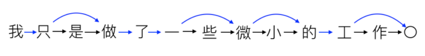
</p>

###### **拓展方法： `N-最短路径法`**

- [x] 保留N条最短的路径，以提供更多分词方案。

<p align="center">
  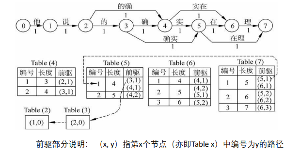
</p>

<!-- tabs:end -->

- [x] 基于匹配分词方法的优劣
  - 优点：效率高、直观性好
  - 缺点：对词典的 `依赖性`
    - 维护高质量词典需要极大的开支
    - 永远难以应对新生词汇
    - 词汇频率/重要性往往对结果不产生影响

<!-- tabs:end -->

#### **<span style="color:darkgreen;">基于统计的分词方法</span>**

- [x] 没有词典，怎么办？从海量文档中去找答案。
- [x] 字与字相邻共现的频率或概率能够较好的反映成词的可信度。
- [x] 如果某两个词的组合在统计上出现的几率非常大，那么我们就认为分词正确。
  - 例如，“上海市长江大桥”。
  - 统计显示，“上海市 / 长江大桥”同时出现的概率，大于“上海市长 / 江/ 大桥”的概率。
  - 那么， “上海市 / 长江大桥”是正确分词的可能性更大。

##### 统计分词的形式化表达

- $c=c_1c_2\dots c_n$ ， $c$ 是待分词的句子(字串)。而 $w = w_1w_2\dots w_m$ 是切分的结果。
- 设 $P(w|c)$ 为 $c$ 切分为 $w$ 的某种估计概率。
- $w_a,w_b,\dots ,w_k$ 为 $c$ 的所有可能的分词方案。
- 那么，基于统计的分词模型就是找到目标词串 $w$ ，使得 $w$ 满足：
  - $P(w|c) = \max\lbrace P(w_a|c), P(w_b|c),\dots, P(w_k|c)\rbrace$
  - 即估计概率最大所对应的词串。

##### 统计分词的一般化过程

1. 建立统计语言模型
2. 对句子按不同方案进行分词
3. 计算不同分词方案的概率，选出概率最大的分词结果
  - 理论上，基于统计的分词方法可以不需要词典，但实际应用中第2步可以采用机械分词方法进行分词，以获得候选的分词集合。
    - 既发挥匹配分词切分速度快、效率高的特点。
    - 又利用了无词典分词结合上下文识别生词、自动消除歧义的优点。

<!-- tabs:start -->

##### **N-gram及其变形**

##### N-gram模型与马尔科夫假设

- [x] N-gram指一个由N个单词组成的集合，各单词具有先后顺序。
- [x] N-gram模型的马尔可夫假设：
  - 当前状态出现的概率仅同过去有限的历史状态有关，而与其他状态无关。
  - 具体到分词任务，就是文本中第 `N` 个词出现的概率仅仅依赖于它前面的 `N-1` 个词，而与其他词无关。
- [x] 常见的N-gram模型：
  - `N = 1` ，一元文法模型(最大概率模型)， $P(w) = P(w_1)P(w_2)\dots P(w_n)$
  - `N = 2` ，Bigram模型， $P(w)=P(w_1)P(w_2|w_1)\dots P(w_n|w_{n-1})$
  - `N = 3` ，Trigram模型， $P(w)=P(w_1)P(w_2|w_1)P(w_3|w_1w_2)\dots P(w_n|w_{n-2}w_{n-1})$
- [x] 二元文法(Bigram)模型(N = 2)的实例

<p align="center">
  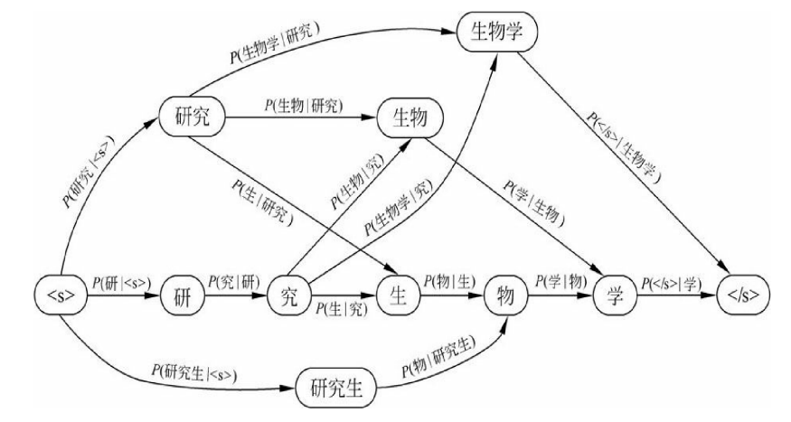
</p>

##### N-gram模型的概率估计

- [x] 以Bigram模型为例，基于最大似然估计进行推断

$$Bigram: \\\\\\ P(w_n|w_{n-1})=\frac{C(w_{n-1}w_n)}{C(w_{n-1})}$$

> - 其中， $C(w_{n-1}w_n)$ 指词序列 $w_{n-1}w_n$ 在语料库中出现的次数。
> - 而 $C(w_n)$ 指某个单词 $w_n$ 在语料库中出现的次数。

##### N-gram模型的分词过程

- [x] 以Bigram模型为例
  1. 首先，构造训练语料库，计算所有的𝐶(𝑤𝑛)与𝐶(𝑤𝑛−1𝑤𝑛)。
  2. 其次，对于每一个可能的分词序列𝒘，计算以下公式
    - $P(w)=P(w_1)P(w_2|w_1)\dots P(w_n|w_{n-1})$
    - 其中， $P(w_n|w_{n-1})=\frac{C(w_{n-1}w_n)}{C(w_{n-1})}$
  3. 最后，返回最大的𝑃(𝑤)所对应的分词序列作为结果。

###### Bigram模型实例

- [x] 例如，判断句子“我想晚上去吃意大利菜”的分词。
- [x] 已知总词数为13748，各个词出现的频率为：

<p align="center">
  
</p>

- [x] 同时，各个词序列的共现次数如下：

<p align="center">
  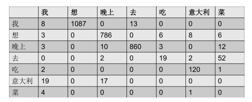
</p>

- [x] 基于上述统计数据，计算“我 / 想 / 晚上 / 去 / 吃 / 菜”这一分词的可能性。
- [x] $P(我) × P(想|我) × P(晚上|想) × P(去|晚上) × P(吃|去) × P(菜|吃)$
- [x] $\frac{3437}{13748} × \frac{1087}{3437} × \frac{786}{1215} × \frac{860}{3256} × \frac{19}{938} × \frac{1}{213} = 0.00000128$

##### 特殊形式：一元文法模型

- [x] 当 `N=1` 时，N-gram模型退化为一元文法模型，此时词与词之间是独立的。

$$P(W)=P(w_1,w_2,\dots ,w_i)\approx P(w_1) × P(w_2) × \dots × P(w_i)$$

> - 这里可以约等于是因为独立性假设，一元文法

$$P(w_i)=\frac{w_i在语料库中的出现次数n}{语料库中的总次数N}$$

- [x] 例如，判断句子“有意见分歧”的分词方案。

<p align="center">
  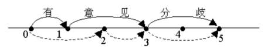
</p>

###### 一元文法模型实例

- [x] 待分词句子：“ 有意见分歧”
  - W1: 有/ 意见/ 分歧/
  - W2: 有意/ 见/ 分歧/

<p align="center">
  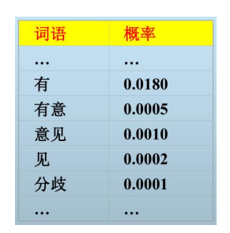
</p>

$$P(W1) = P(有) × P(意见) × P(分歧) = 1.8 × 10^{-9}$$
$$P(W2) = P(有意) × P(见) × P(分歧)= 1×10^{-11}$$

> - 由于 $P(W1)>P(W2)$ ，因此，第一种分词更合理。

##### 基于统计文法模型的优劣

- [x] 优点：减轻了对于词典的依赖性
  - 然而，这种依赖并非完全消除，取决于性能与效率的平衡
    - 如果深度结合机械分词(匹配分词)，则效率提升但依赖词典
    - 如果减少对词典的依赖，则需要更多地遍历潜在的组合(解空间巨大！)
- [x] 缺点：依赖已有数据中词频的统计，对于新生词汇或专业词汇不友好
  - 冷门领域的稀有词汇往往难以准确划分
  - 易受数据集先验偏差(Bias)的影响

##### **HMM与CRF**

- [x] 基于序列标注的分词方法
  - 基于词典的机械分词方法所面对的主要问题在于未登录词识别。
  - 基于统计模型的分词方法，进一步抽象而言，可以得到一个序列标注问题
    > - 四类标注：B(词的开始)、M(词的中间)、E(词的结束)、S(单字词)
    > - 例子： `中国科学技术大学是中国最好的大学`
    > > - 标注：BMMMMMME S BE BME BE
    > > - 分词结果：中国科学技术大学 / 是 / 中国 / 最好的 / 大学

<!-- tabs:start -->

###### **隐马尔可夫模型(HMM)**

- [x] 隐马尔可夫模型(HiddenMarkov Model)
  - 基本的思想是根据观测值序列，找到真正的隐藏状态值序列
    - 在中文分词中，每个字符是观测值，而标签(BMES)为隐藏状态值

<p align="center">
  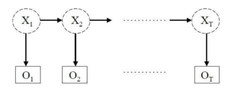
</p>

- [x] 基本的思想是根据观测值序列，找到真正的隐藏状态值序列
  - 观测值：你获得的食物
  - 隐藏状态：实际去的购物地点

- [x] 隐马尔可夫模型的五个核心要素：两个集合、三个矩阵
  - 两个集合：观测值集合(字符集合)、隐藏状态值集合(BEMS)
  - 三个矩阵：
    - 观测状态概率矩阵：从隐含状态(标签)到观测值(字符)的转移概率
    - 隐含状态转移概率矩阵：各种隐含状态(各种标签)之间的转移概率
    - 初始状态概率矩阵：第一个字属于某种隐含状态(BMES)的概率

- [x] 根据上述元素，我们将隐马尔可夫模型下的中文分词问题表述为如下形式：
  - 当我们观测到句子 $w_1,w_2, \dots ,w_n$ ，其中 $w_i$ 为第 $i$ 个汉字，我们希望找到相应的标签序列 $s_1, s_2\dots s_n$ ，其中 $s_i$ 为 $w_i$ 对应的标签(BMES中的一种)，使得 $P(s_1, s_2\dots s_n|w_1, w_2\dots w_n)$ 概率最大。

- [x] 为求解这一目标函数，需要隐马尔可夫模型的两个基本假设：
  - 齐次假设：当前隐藏状态只与上一个状态有关系，即 $P(s_i|s_{i-1},s_{i-2},\dots ,s_1)=P(s_i|s_{i-1})$
  - 观测独立性假设：观测值之间互相独立的，只与生成它的状态有关系，即 $P(w_1,w_2,\dots ,w_n|s_1, s_2, \dots ,s_n)=P(w_1|s_1)P(w_2|s_2)\dots P(w_n|s_n)$

- [x] 基于目标函数和两个基本假设，基于隐马模型的中文分词问题转化为：
- [x] 我们希望找到相应的标签序列 $s_1, s_2\dots s_n$ ，使得 $\sum\limits_{i=1}^N P(s_i|s_{i-1})P(w_i|s_i)$ 概率最大。
- [x] 针对这一问题，可采用 `维特比(Viterbi)` 算法进行求解：
  1. 初始化：对第一个字，分别以BEMS四种状态计算其概率
  2. 递归：对第 i 个字，遍历四种状态，先计算该状态最可能是由前一时刻的哪个状态转换而来的，再乘以该状态下得到观测值(字)的概率，取最大值。
  3. 终止：在第 n 个字时，取得到的最大概率，并得到最后一个字的状态标签。
  4. 回溯：由最优路径的终点向前，找到各个时刻的最优状态，还原全部标签。

<!-- tabs:start -->

###### **例题**

- [x] 记 $S$ 是所有可能的状态的集合， $S=\lbrace s_1,s_2 \rbrace =\lbrace T,F \rbrace$
- [x] $I=(s_{i_1},s_{i_2},s_{i_3})$ 是长度为3的状态序列，其对应的观测序列为 $W=(w_1,w_2,w_3)=(X,Y,Z)$
- [x] 隐含状态转移概率矩阵为

$$A=[a_{ij}]_{2×2}=\left(\begin{matrix}
0.7 \ 0.3\newline
0.4 \ 0.6\newline
\end{matrix}\right)$$

> - 其中， $a_{ij}=P(i_{t+1}=s_j|i_t=s_i) i=1,2;j=1,2$ 表示在时刻 $t$ 处于状态 $s_i$ 的条件下在时刻 $t+1$ 转移到状态 $s_j$ 的概率。

- [x] 观测状态概率矩阵为

$$B=[b_{j}(k)]_{2×3}=\left(\begin{matrix}
0.5 \ 0.4 \ 0.1\newline
0.1 \ 0.3 \ 0.6\newline
\end{matrix}\right)$$

> 其中， $b_{j}(k)=P(w_{t}=v_k|i_t=s_j) k=1,2,3;j=1,2$ 表示在时刻 $t$ 处于状态 $s_j$ 的条件下生成观测 $v_k$ 的概率。

- [x] $\pi$ 是初始状态概率向量： $\pi = (\pi_1, \pi_2)=(0.6, 0.4)$ ，其中， $\pi_i=P(i_1=s_i), i=1,2$ 表示在时刻 $t=1$ 处于状态 $s_i$ 的概率
- [x] 前述例题中对应的三个矩阵：

<p align="center">
  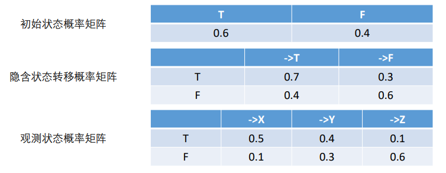
</p>

- [x] 问：观测到显式状态序列依次为 $X、Y、Z$ ，最可能的隐含状态序列是什么？

###### **题解**

- (1) 初始化
  - 在 $t=1$ 时，对每一个状态 $s_i$ (记显式状态 $T$ 为 $s_1$ , $F$ 为 $s_2$ )，计算状态为 $s_i$ 观测 $w_1$ 为 $X$ 的概率，记此概率为 $\delta_1(s_i)$ ，则

$$\delta_1(s_i)=\pi_ib_i(w_1) \\\\\\ i=1,2$$

> 代入实际数据

$$\delta_1(T)=0.6×0.5=0.3$$

$$\delta_1(F)=0.4×0.1=0.04$$

> <span style="color:red;">可见，第一个隐状态为T更为合理</span>

- (2) 在 $t=2$ 时，对每一个状态 $s_i$ ，求在 $t=1$ 时状态为 $s_j$ 观测为 $X$ 并在 $t=2$ 时状态为 $s_i$ 观测 $w_2$ 为 $Y$ 的路径的最大概率，记此最大概率为 $\delta_2(s_i)$ ，则

$$\delta_2(s_i)=\max\limits_{1\leq j \leq 2}\lbrace \delta_1(s_j)a_{ji} \rbrace b_i(w_i)$$

- 同时，对每个状态 $s_i$ ，记录概率最大路径的前一个状态 $s_j$ 所对应的下标 $j$ ：

$$\psi_2(s_i)=\underset{\substack{1\leq j \leq 2}}{\arg\max}\lbrace \delta_1(s_j)a_{ji} \rbrace , i= 1,2$$

>  <span style="color:darkcyan;">1、2分别对应T、F</span>

- 计算：

$$\delta_2(T)=\max\limits_{1\leq j \leq 2}\lbrace \delta_1(s_j)a_{j1} \rbrace b_1(w_2)=\max\limits_{1\leq j \leq 2}\lbrace 0.3 × 0.7,0.04 × 0.4 \rbrace × 0.4=0.084$$

$$\delta_2(F)=0.027$$

$$\psi_2(T)=\underset{\substack{1\leq j \leq 2}}{\arg\max}\lbrace \delta_1(s_j)a_{ji} \rbrace=\underset{\substack{1\leq j \leq 2}}{\arg\max}\lbrace 0.3 × 0.7,0.04 × 0.4 \rbrace = 1$$

$$\psi_2(F)=1$$

> <span style="color:red;">显然，第二个隐状态为T的概率仍然高于F的概率</span>

- 同理，在 $t=3$ 时，

$$\delta_3(T)=\max\limits_{1\leq j \leq 2}\lbrace \delta_2(s_j)a_{j1} \rbrace b_1(w_3)=\max\limits_{1\leq j \leq 2}\lbrace 0.084 × 0.7,0.027 × 0.4 \rbrace × 0.1=0.00588$$

$$\delta_2(F)=0.01512$$

$$\psi_3(T)=\underset{\substack{1\leq j \leq 2}}{\arg\max}\lbrace \delta_2(s_j)a_{j1} \rbrace=\underset{\substack{1\leq j \leq 2}}{\arg\max}\lbrace 0.084 × 0.7,0.027 × 0.4 \rbrace = 1$$

$$\psi_2(F)=1$$

- (3) 以 $P*$ 表示最优路径的概率，则

$$P*=\max\limits_{1 \leq i \leq 2}\delta_3(s_i)=0.01512$$

- 最优路径的终点下标 $i_3\*$ 是 $i_3^\*=\underset{\substack{i}}{\arg\max}\lbrace \delta_3(s_i) \rbrace=2$

> <span style="color:red;">此时，第三个隐状态为F的概率更高</span>

- (4) 由最终路径的终点下标 $i_3\*$ ，逆向找到 $i_1\*,i_2\*$ ：

- 在 $t=2$ 时， $i_2\*=\psi_3(s_{i_3\*})=\psi_3(F)=1$
- 在 $t=1$ 时， $i_2\*=\psi_2(s_{i_2\*})=\psi_2(T)=1$
- 于是求得 $(i_1\*,i_2\*,i_3\*)=(1,1,2)$
- 最优状态序列 $$

<!-- tabs:end -->

###### **条件随机场模型(CRF)**

- [x] 隐马尔可夫模型的独立性假设难以描述字词之间的复杂关联。
- [x] 条件随机场模型(Conditional Random Field)

<p align="center">
  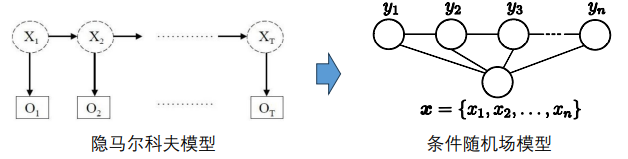
</p>

- [x] 有关条件随机场的深入学习，可参见ICML 2001论文或《统计自然语言处理》第6.9节
  - Lafferty, et. al. "Conditional random fields: Probabilistic models for segmenting and labeling sequence data." ICML 2001
- [x] 相关工具包：CRF++(https://taku910.github.io/crfpp/)、Genius(https://github.com/duanhongyi/genius)等

<!-- tabs:end -->

##### **基于深度学习的分词方法**

- [x] 随着技术的发展，深度学习逐渐成为分词的主流技术
- [x] 循环神经网络(Recurrent Neural Networks)有效解决了文本序列建模的上下文学习问题。
- [x] 由于语句长短不同，当需要较长上下文关系时，RNN对信息依赖的学习能力有限。

<p align="center">
  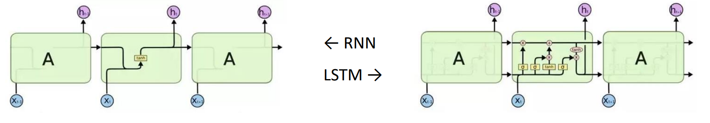
</p>

- [x] 长短时记忆模型（Long Short-Term Memory）通过四层神经网络代替RNN中原有的单一神经网络层，使其拥有增加或减少信息的能力。
  - 新增了保存长期信息的单元状态，以及控制保存、输出长期状态和输入瞬时状态的“门”

- [x] LSTM与统计模型的结合
  - 基于LSTM方法解决分词问题，传统解决思路是采用LSTM+SoftMax分类的思路。
    - 忽略了预测序列的标签之间的关联性。
    - 可能导致错误标签序列的出现，例如：B后又出现了B。
  - 通过结合LSTM与HMM/CRF等统计模型技术，将有效利用句子级别的标记信息。
    - 输出的将不再是相互独立的标签，而是最佳且合理的标签序列。

<p align="center">
  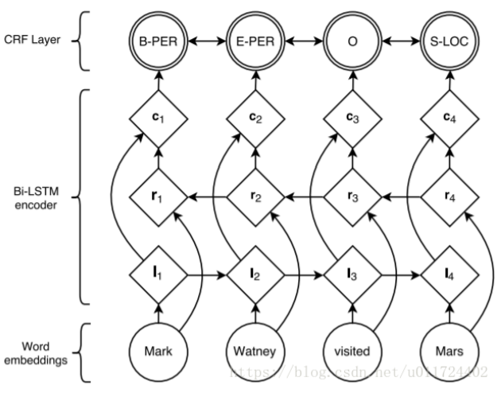
</p>

<!-- tabs:end -->

<!-- tabs:end -->

### 常用分词工具

#### 常用的中文分词工具

- `NLPIR-ICTCLAS` ： https://github.com/NLPIR-team/NLPIR
  - 中科院/北理工研发，基于HMM技术，界面友好，效果尚可
- `结巴分词` ：https://github.com/yanyiwu/cppjieba/
  - 基于HMM技术，有专门的Python库支持：https://github.com/fxsjy/jieba
  - 语言支持最丰富(Java、C++、R等)，支持多种分词模式，支持自定义词典
- `HanLP` ：https://github.com/hankcs/HanLP
  - 由大快搜索主导并完全开源，语料时新、可自定义
- `THULAC` ：https://github.com/thunlp/THULAC
  - 集成了当时规模最大的人工分词和词性标注中文语料库，效果好，速度快
- `PKUSeg` ：https://github.com/lancopku/PKUSeg-python
  - 北大研发，分词准确率大幅提升。
  - 支持多领域分词，支持用全新的标注数据来训练模型。

#### 常用的英文分词工具

- `Stanford NLP` ：https://nlp.stanford.edu/software/index.shtml
- 支持多种语言的完整文本分析管道
  - 包括分词、词性标注、词形归并和依存关系解析等任务
- 提供了与 CoreNLP 的 Python 接口。
  - CoreNLP： https://stanfordnlp.github.io/CoreNLP/
- Stanford Word Segmenter
  - https://nlp.stanford.edu/software/segmenter.html

#### 分词工具包测试

- [x] 公众号：AINLP
  - 支持包括Jieba、PKUSeg、THULAC等在内的10种分词工具的测试
  - 还支持词性标注，命名实体识别、情感分析，相似词查询，诗句生成等

#### 分词可能带来的隐患

- [x] 分词带来的大量低频词，导致严重的数据稀疏。
- [x] 越来越多的OOV(Out of Vocabulary)词。
- [x] 分词中难免的错漏将导致额外的噪声。
- [x] 深度学习发展，分词的收益愈发有限。
- [x] 大模型时代，语义理解工具远胜以往。

## 停用词处理

### 停用词的概念与意义

- [x] 停用词，Stopwords，指文档中频繁出现或对实际语义影响不大的词语。
  - 例如，英文中的The、of，中文中的“的”、“是”等。
  - 数字、副词等与语义关系不大的词常作为停用词被处理。
- [x] 为什么要去除停用词？
  - 重复率很高，会造成索引中的倒排表很长，影响查询性能。
  - 对最后结果的排序没什么贡献，反而可能产生干扰。

### 停用词的概念与意义

- [x] 停用词的设置与语料库的性质有关
  - 除通用停用词表外，特定学科或领域也具有其专用的停用词。
  - 例如，URL中的www，Wikipedia中的wiki
- [x] 常用的停用词识别方法
  - 较为成熟的停用词识别方法有: 文本频率、词频统计、熵计算等。
  - 更为复杂的算法将结合统计与句法或内容分析。
- [x] 常用的停用词表：哈工大停用词表、百度停用词表、 NLTK停用词表等。

### 去除停用词可能导致的隐患

- [x] 有些停用词在特定场景下是有意义的
  - 例如，“非”、“不”表示否定；“较”、“稍微”表示程度等。
- [x] 有些停用词的组合是有意义的
  - 例如，“的确”、“To be or not to be”。
  - 依赖于分词的效果。

### 未来停用词的使用趋势

- [x] 现代搜索引擎的趋势是逐渐减少对停用词的使用。
- [x] 现代搜索引擎更关注利用语言的统计特性来处理常见词问题。
  - 采用压缩技术，降低停用词表的存储开支。
  - 引入词项权重，将高频词的影响降至最低。
  - 索引去除技术，低于权重的词项将被排除。

## 规范化处理

### 文本规范化的意义

- [x]  文本处理的主要目标在于优化查询词与索引词之间的匹配。
- [x] 然而，两方的文本内容都可能出现各种各样的干扰情况：
  - 大小写、缩写、标点等的干扰，e.g., USA与U.S.A
  - 不同时态等导致的词形不同，e.g., have / has
  - 同义词 / 相关词等的干扰，e.g., 中科大与中国科大
  - 用户个性化表述方式，如方言
- [x] 规范化的目的就在于尽量保证索引词项符合用户查询输入。

### 归一化处理

- [x] 归一化/词根化，指还原词语的特殊形式的过程。
- [x] 例如：
  - $Ran, running \rightarrow run$
  - $Universities \rightarrow university$
- [x] 往往针对英语等语言，汉语并不需要这一步。
- [x] 词根化处理可以有效降低词项的数量并减少歧义。

#### 词干提取

- [x] Stemming，指去除单词前后缀，获得词根的过程。
- [x] 常见的前后词缀有“复数形式”、“过去分词”、“进行时”等。

<p align="center">
  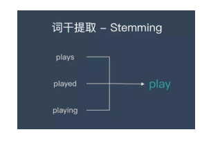
</p>

#### 词形还原

- [x] Lemmatisation，指基于词典，将单词的复杂形态转变成最基础的形态。
- [x] 并不是简单地将前后缀去掉，而是会根据词典将单词进行转换。

<p align="center">
  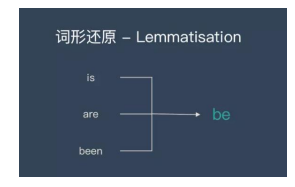
</p>

#### 词干提取与词形还原的异同

- [x] 词干提取与词形还原的相同点
  - 目标一致。两者的目标均为将词的不同形态简化或归并为基础形式。
  - 结果交叠。两者不是互斥关系，其结果有部分交叉。
  - 方法类似。目前两者主流方法均是利用语言中的规则或词典实现。
- [x] 词干提取与词形还原的不同点
  - 在原理上，词干提取采用“缩减” ，而词形还原采用“转变” 。
  - 在复杂性上，词形还原需考虑词缀转化、词性识别等，更为复杂。
  - 在实现上，词干提取主要利用规则变化，而词形还原更依赖于词典。
  - 在结果上，词干提取不一定得到完整单词，而词形还原是完整单词。

#### 基本词干提取方法：Porter Stemming

- [x] 英文中最常用的词干提取方法。
- [x] 使用一系列后缀变换规则对单词进行变换。
- [x] 其开源版本可通过网络获得。
  - 例如：http://tartarus.org/~martin/PorterStemmer/
  - 升级版本： http://snowball.tartarus.org/algorithms/english/stemmer.html
  - 也可以通过以下网站进行在线简单测试：
  - https://textanalysisonline.com/nltk-porter-stemmer

##### Porter Stemming的基本流程

1. 去除单词的复数形式
2. 去除 `-ed(ly)` 或 `-ing(ly)` 等后缀
3. 将 `–y` 改为 `–i`
4. 处理双重后缀，如 `–ization` 等
5. 处理 `–full` ， `–ness` 等后缀
6. 处理 `–ant` ， `–ence` 等后缀
7. 去除掉最后的 `–e` 和 `–ll`

<p align="center">
  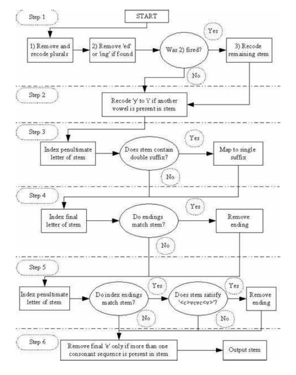
</p>

### 错误拼写检查/拼写错误处理

- [x] 用户在输入查询条件时，往往容易出现拼写错误(>10%)。
- [x] 通常采用基于词典或编辑距离的方式进行检查和校对。
- [x] 编辑距离(Levenshtein Distance)
  - 指两个字符串之间转换所最少需要的编辑操作步数。
  - 允许的一步编辑操作包括替换、插入或删除一个字符。
    - 例如：Distance(“Kitten”, “Sitting”) = 3
      > - kitten → sitten (substitution of "s" for "k")
      > - sitten → sittin (substitution of "i" for "e")
      > - sittin → sitting (insertion of "g" at the end).

<p align="center">
  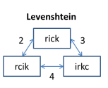
</p>

- [x] 不必要的拼写错误处理将影响用户体验。
- [x] 在判断用户真实意图的基础之上，准确理解用户输入的查询条件。
- [x] 采用更为友好的方式处理可能的“拼写错误”。

### 同义词/相关词处理

- [x] 比词根化和拼写错误更难处理，通常借助人工维护的知识库。
- [x] 常见的词与词之间的关系：
  - 同义词，e.g., college ≈ university
  - Is – a关系，e.g., Boeing 737 max is a plane.
  - Is – part – of关系，e.g., Nokia is part of Microsoft
  - 反义词，e.g., Young v.s. Old
- [x] 基于人工维护的知识库，获取各种词项之间的关系。
- [x] 例如，WordNet：https://wordnet.princeton.edu/
  - 大型的英文词汇数据库，将不同词性的单词归类至不同的认知同义词集合中。
  - 目前，已有超过117000个认知同义词集合。

<p align="center">
  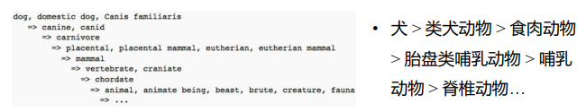
</p>

- [x] 相关应用：基于同义词 / 相关词，拓展查询条件。

<p align="center">
  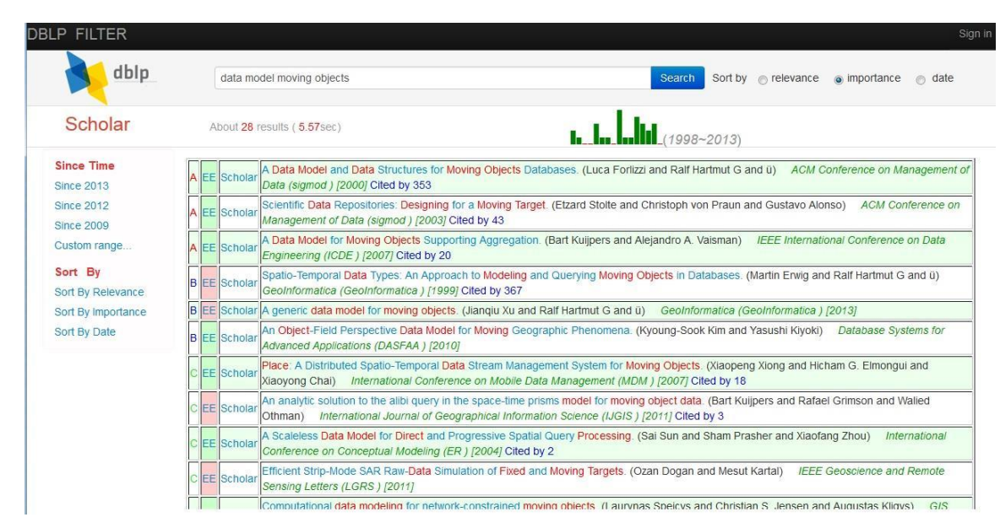
</p>

- [x] 中文的同义词 / 相关词处理及相关词典：
  - HowNet(知网)：http://www.keenage.com/html/c_index.html
    - 包含6万个汉字、1.1万个词语、句法结构式58个……
  - Chinese WordNet(繁体)：http://lope.linguistics.ntu.edu.tw/cwn2/
  - 大词林：http://www.bigcilin.com/browser/
- [x] 在实际工作中，可以根据需要选择中文语义词库。


