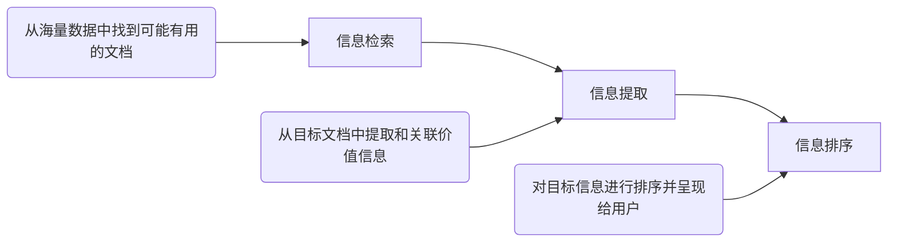
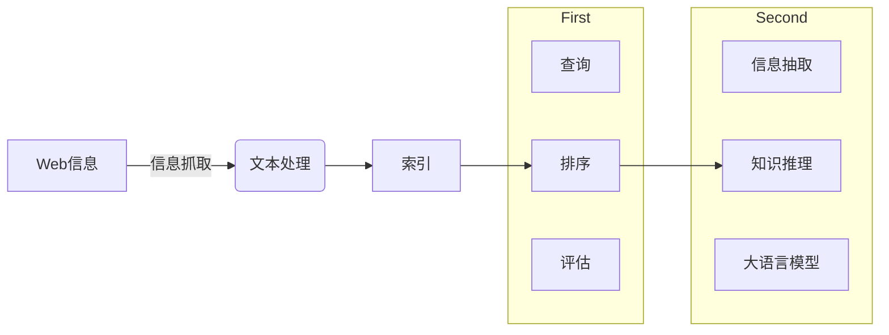
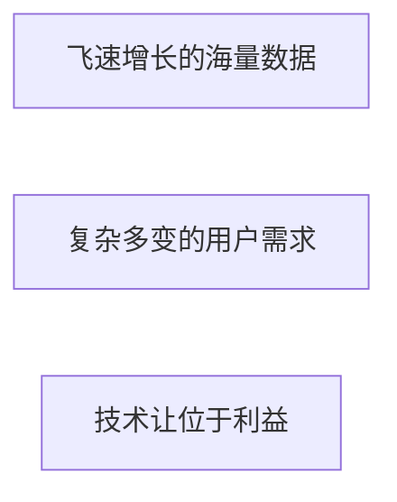

# 课程相关

## 课程主页

- [点此链接](http://staff.ustc.edu.cn/~tongxu/webinfo/)

## 课程安排

- [x] 课程形式：讲课 + 实验
  - 理论学时 60 学时 + 实验学时 30 学时(无单独实验课安排)
- [x] 成绩组成： $\color{red}{50}$ % 考试成绩 + $\color{blue}{40}$ % 实验成绩 + 10% 作业成绩(上下半学期各一次，涉及部分章节)
- [x] 实验安排
  - 信息检索、知识图谱、大语言模型各一次实验
    > - 实验大约将第3周、第11周、第15周发布
    > - 2-3人一组，按组进行打分，可以单人进行(无优惠政策)
- [x] 考试形式：半开卷(一张A4纸)

# 第一节 绪论

## 课程主旨

- 问题输入：卷帙浩繁的信息海洋
- 问题输出：满足需求的特定信息
- 解决方案可以分为以下三步

## 课程背景

- [x] 案例1：文档搜索
  - 基于搜索关键词，寻找最相关的文档，是信息检索的基本任务

- [x] 案例2：多模态搜索
  - 从单一的文本信息到更为复杂的多模态搜索，任务与方法都在拓展

- [x] 案例3：面向知识的搜索
  - 人们已不再满足于单纯呈现原始的文档，而需要更加精炼的知识表达与更加直观的需求解决

## 课程框架

- [x] 本课程所要解决的问题
  - Web信息如何获取？【网络爬虫】
  - Web信息如何整理与存储？【文本处理、索引】
  - Web信息如何有效搜索？【查询/排序/评估】
  - 如何提炼价值信息与知识？【信息抽取】
  - 如何基于知识进行推理应用？【知识图谱应用】
  - 大语言模型技术将为信息检索带来什么？【LLM导论】

## 课程内容

- [x] 围绕“ $\color{red}{信息检索}$ ”、“ $\color{blue}{知识图谱}$ ”两大模块

  
  
  

## Web 信息基础

### Web信息起源

- [x] Web信息起源：1965，超文本概念提出
  - Ted Nelson在1965年提出了超文本的概念。
    > - HyperText，源自于“非连续性著述”( `Non sequential writing` ，Web的第一个特性)的理念，即分叉的、允许读者作出选择的文本。
    > - 以海量数据为基础，使原先的线性文本变成无限延伸、扩展的非线性文本。
  - 超文本传输协议(HTTP ，HyperText Transfer Protocol)
  - 超文本标记语言(HTML，HyperText Markup Language)

- [x] Web信息起源：1969，因特网起源
  - 1969年，互联网的原型 `ARPANet` 由美国国防部研究计划署(DARPA)所制定的协定下诞生，首先用于军事连接。
    > - 起初只有4个结点，分布在UCLA等四所大学的4台大型计算机。
    > - ARPANet的试验较好地解决了异种机网络互联的一系列理论和技术问题，并推动了TCP/IP协议的诞生(1983)。
  - 1986年，美国国家科学基金会(NSF)建立NSFNet广域网，逐渐取代了ARPANet。

- [x] Web信息起源：1989，万维网诞生
  - 1989年，欧洲核子物理研究所(CERN)的Tim Berners Lee(万维网之父)等人首次提出了一个分类互联网信息的协议，即World Wide Web
    > - 在1990年，他写出了第一个网页：http://info.cern.ch
    > - 他定义了URLs、HTML、HTTP等的规范，使网络能够为大众所使用。
    > - 他创立了万维网联盟(World WideWeb Consortium，W3C)并担任主席

### Web特点

- Web的信息流视角：Web 1.0时代

- Web的信息流视角：Web 2.0时代
  - 我们每个人，既是信息的消费者，也是信息的生产者

- Web的信息流视角：Web 3.0时代
  - 两个不同方向但又相互耦合的猜想
    > - $\color{red}{更加个性化、更加智能化、跨越平台与站点的信息大一统}$
    > - $\color{blue}{更加去中心化，基于区块链支撑的用户确权，以用户为中心}$

### Web搜索发展史

#### 搜索起源

- [x] 搜索引擎发展史：1990年，Archie
  - Archie：一般公认最早的搜索引擎
    > - 由麦吉尔大学的Alan Emtage等几位学生发明，用于搜索互联网上的匿名FTP
    > - Archie依靠脚本文件搜索互联网上的匿名FTP(无需登录信息)，然后根据用户需求反馈相应的文件，它的实质是一个可搜索的FTP文件名列表。
  - 目前仍有少量提供Archie服务的网站

- [x] 搜索引擎发展史：1993年，Wanderer
  - Wanderer：最早的爬虫
    > - 由MIT的学生Matthew Gray设计
    > - 原意用于统计互联网上服务器的数量，而非为搜索引擎所设计
  - Wandex：最早的网页索引计划
    > - Wanderer后来发展为可以捕获网址，而为这些网址建立索引的计划就是Wandex
  - 其他诞生于1993年的Robots
    > - ALIWEB(Archie-like Index of WEB，发表于首届WWW会议)
    > - WWW Worm，收集了海量多媒体文件，并可通过关键词检索

- [x] 搜索引擎发展史：1994年，Yahoo！
  - 1994年，最老的“分类目录”搜索数据库之一Yahoo诞生
    > - 由美籍华人Jerry Yang(杨致远)与David Filo所共同创造
    > - 最早的Yahoo的数据是手工输入的，实际上只是一个可搜索的目录
    > - 1995年，Yahoo网站正式上线

- [x] 搜索引擎发展史：1994年，Lycos
  - 1994年诞生，搜索引擎中的元老，是最早提供信息搜索服务的网站之一
  - 通过前缀匹配与字符近似匹配，提供网页自动摘要和相关性排序，数据量较大，整合了搜索数据库、在线服务和其他互联网工具
  - 2000年被西班牙网络集团收购后，目前是全世界最大的西班牙语搜索引擎

- [x] 搜索引擎发展史：1994年，Infoseek
  - 1994年诞生，沿袭了Yahoo！与Lycos的概念。
  - 1995年，与网景公司(Netscape)的战略性协议实现强强联合
  - 2001年2月，Infoseek改用Overture的搜索结果
  - 李彦宏曾担任Infoseek核心工程师，主导了Infoseek的革新换代

- [x] 搜索引擎发展史：1995年，Metacrawler
  - 1995年，第一个元搜索引擎诞生，由华盛顿大学的两位硕士生共同开发
  - 元搜索引擎的概念(Meta SearchEngine Roundup)
    > - 用户提交搜索后，由元搜索引擎负责转换处理，然后提交给多个预先选定的独立搜索引擎
    > - 各独立搜索引擎返回查询结果后，再集中处理并返回给用户

- [x] 搜索引擎发展史：1995年，Altavista
  - 第一个支持自然语言搜索的引擎
  - 第一个实现高级搜索语法的引擎
    > - AND、OR、NOT等
  - 2003年，Altavista被Overture收购，后者是Yahoo的子公司

- [x] 搜索引擎发展史：1997年，Google
  - 1997年，全球最大的搜索引擎Google诞生。
  - 1995年，Larry Page(PageRank因此得名)来到斯坦福攻读博士，并开始研究网络链接项目
  - 他与Sergey Brin提出了PageRank技术，并用于搜索引擎，从而改写了搜索引擎的定义
  - 1997年，Google.com域名被注册，1998年，Google公司正式成立

- [x] 搜索引擎发展史：1997年，天网
  - 国内第一个基于网页索引搜索的搜索引擎，见证了中国互联网发展史
    > - 由北京大学网络实验室研究开发，是国家重点科技攻关项目"中文编码和分布式中英文信息发现"的研究成果。
    > - 于1997年10月29日正式在CERNET上向广大互联网用户提供Web信息搜索及导航服务
    > - 教育网优势，FTP搜索功能强大

- [x] 搜索引擎发展史：2000年，百度
  - 2000年，由前Infoseek资深工程师李彦宏创立
    > - 专注于中文搜索领域，目前是最大的中文搜索引擎
    > - 2003年，根据某在线调查，百度已超越Google成为中国网民首选的中文搜索引擎

- [x] 搜索引擎发展史：下一代搜索引擎？
  - 2009年，Wolfram Alpha上线
    - 搜索引擎？计算知识引擎！
    - 直接向用户返回答案，而不是返回网页链接
      > - 倘若输入“抛10次，4次正面向上”，它可以回答抛硬币的概率问题。甚至连某地下一次日食的时间，或者国际空间站现在的位置，它都能给你答案
  - 2016年，微软小冰读心术
    - 如何明确用户的检索需求？
    - 通过若干连续问题确认用户的真实意图，避免歧义干扰
      > - 本质是决策树的应用
      > - 背后有庞大的数据库支撑
      > - 如何设计提问策略是核心问题
  - 2023年，NewBing
    - 与大模型相结合，开启信息检索新时代
    - 从提供信息，抽取/归纳信息到“生成”信息，提供更灵活与更友好的服务
      > - 基于海量数据堆积而成的“涌现”能力
      > - 借助思维链“去伪存真”
      > - 用户反馈与互动帮助其成长
      > - `小心背后的“幻觉”现象`

### Web搜索的挑战

- [x] 来自三方面的挑战：数据、用户、利益

#### 来自数据的挑战

- [x] 来自数据的挑战：海量数据
  - 数据的积累，无论绝对增长还是相对增速都是惊人的数字

- [x] 来自数据的挑战：异构数据
  - 无论是网页结构的不同，还是数据模态的不同，都对Web信息的有效处理带来了挑战

- [x] 来自数据的挑战：数据质量
  - Web中包含大量未经编辑处理或权威确认的信息，可能导致错误、无效或误导

- [x] 来自数据的挑战：数据不稳定性
  - 许多网站和文档快速的添加和消亡，导致大量死链的存在
  - 甚至，已有网页内容也在不断地发生更新

#### 来自用户的挑战

- [x] 来自用户的挑战：查询需求的表达
  - 用户可能无法采用规范、清晰的方式表达其查询需求
  - 用户表达的非规范性 × 语义演化的日新月异 → 玩梗

- [x] 来自用户的挑战：知识需求与直观表达
  - 技术使人们缺乏耐心，希望直接从搜索引擎获得答案，而不是通过阅读文档自行得到答案

- [x] 来自用户的挑战：个性化需求
  - 大众化的信息需求被个性化、差异化的信息需求所取代

#### 来自利益的挑战

- [x] 来自利益的挑战：SEO对于搜索的干扰
  - 搜索引擎优化( `Search Engine Optimization` )，可能提升网站效率，也可能因滥用搜索算法而影响正常使用

- [x] 来自利益的挑战：竞价排名对于搜索的干扰
  - 基于广告改变排序，对使用者产生误导

- [x] 来自利益的挑战：低质内容的滥觞——洗稿
  - 技术的滥用导致洗稿工具等手段盛行拉低内容质量，恶化用户体验

## 信息检索概述

### 基本概念

- [x] 信息检索(Information Retrieval)
  - 基本含义：给定用户需求，从数据库中寻找并反馈相关的文档
    - Query：用户的查询需求
    - Corpus：待检索的数据库
    - Relevance：文档满足查询需求的程度
  - <kbd>信息检索是关于信息的结构、分析、组织、存储、搜索(Search)和获取(Retrieval)的领域  —— Gerard Salton，1968</kbd>

### 信息检索的发展历史

- 1950年，明尼苏达大学的Calvin Mooers提出了“信息检索”这一概念
- 1960年代，康奈尔大学的Gerard Salton研发了SMART系统，被视作信息检索的鼻祖
- 1970年代，SIGIR成立，信息检索领域的旗舰学术会议由此开始
- 1980年代，商用IR系统开始出现
- 1990年代，TREC会议于1992年起始，开始标准测评、Web搜索等研究

### 信息检索 vs. 数据库

- [x] 数据库属于标准的结构化数据，而信息检索往往面临文本、图像、视频等非结构化或半结构化数据。
- [x] 数据库依赖精确的查询条件，而信息检索的查询词更加自由，匹配也相对粗疏
- [x] 数据库对排序并不强调，而信息检索的效果关键在于相关性排序

### 信息检索的应用场景

- 通用搜索
  - 一般的Web搜索，IR最常见的应用

- 垂直搜索(Vertical Search)
  - 搜索被限定在特定的主题和领域上

- 内部搜索
  - 内部网络甚至个人电脑中的搜索引擎

- P2P搜索(Peer-to-peer Search)
  - 由节点构成的网络中寻找信息，但没有集中式的控制

### 信息检索的基础问题

#### 查询理解

- [x] 信息需求是人们发送查询的背后动因
- [x] 准确理解查询需求是信息检索的前提
- [x] 用户是搜索质量的终极判定者，需要通过与用户的交互，帮助用户表达他们的信息需求
  - 通过上下文信息去除歧义影响

- [x] 查询建议、查询扩展等应用

#### 相关性计算

- [x] 相关性是判断是否满足需求的基础，基于相关性的排序决定了文档呈现顺序
- [x] 单纯依赖查询和文档的简单匹配，未必能够得到所需的结果
- [x] 不同类型的检索模型(Retrieval Model)导致了不同假设的相关性计算

#### 效果评估

- [x] 信息检索的质量取决于反馈文档与用户期望的匹配程度

- [x] 常见的评价指标：准确率(Precision)、召回率(Recall)、F值(F-measure)等

- [x] 活跃的基准测试项目：TREC
  - https://trec.nist.gov/
  - 围绕问答、特定领域检索、主体识别等项目展开测评

#### 检索性能

- [x] 如何快速响应用户的检索需求？
- [x] 如何利用索引减少检索所需时间？
- [x] 如何对检索条件和规则进行模块化，以实现效果与效率的均衡？
